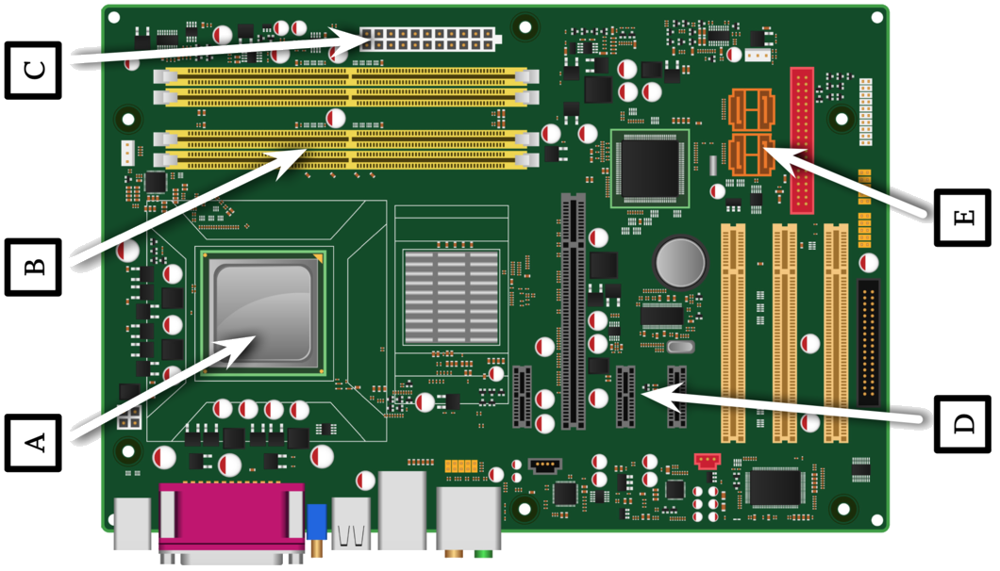
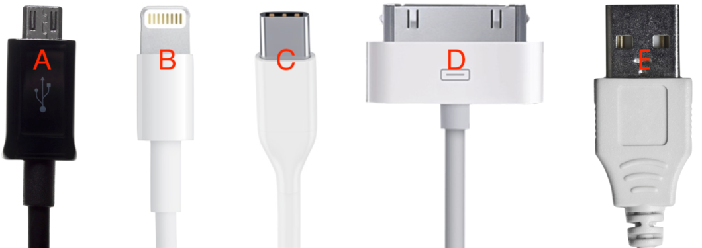

# Assignment 01: Week 01

Before attempting this assignment, please make sure you have completed all of the material in the lessons tab.

Create a copy of this google document [lastname_A01](https://docs.google.com/document/d/1A3s3DwVEP607At1GYPeiQSwwgAvWwRGNGJ8jffxVXKA/edit?usp=sharing) (File > Make a Copy) to record all of your assignment answers in.

> :warning: Failure to use answer document properly will result in a 10pt deduction from final score.

The table of contents for this lab is found below.

&nbsp;&nbsp;&nbsp;&nbsp;&nbsp;&nbsp; Part 1: Laptop: Hardware, Displays, Features  
&nbsp;&nbsp;&nbsp;&nbsp;&nbsp;&nbsp; Part 2: Mobile: Devices, Connections, Accessories, Connectivity   
&nbsp;&nbsp;&nbsp;&nbsp;&nbsp;&nbsp; Part 3: Configuring Email on Mobile Devices, Synchronization  
&nbsp;&nbsp;&nbsp;&nbsp;&nbsp;&nbsp; Part 4: Submission  

## Part 1: Laptop: Hardware, Displays, Features

:interrobang: Question 1 - What are the differences between a HDD, SSD and SSHD?  

:interrobang: Question 2 - Define the term optical drive. Are they common in modern laptops?  

:interrobang: Question 3 - Identify the labeled components in the figure below:  

* Label A: 
* Label B: 
* Label C: 
* Label D: 
* Label E: 

:interrobang: Question 4 - Compare and contrast LCD and OLED screens. Which are more common on laptop devices?  

:interrobang: Question 5 - What are common laptop input voltages?  

:interrobang: Question 6 - Describe in detail what a motherboard is and what it's purpose is.  

:interrobang: Question 7 - Describe in detail what a CPU is and what it's purpose is.  

:interrobang: Question 8 - Describe in detail what a GPU is and what it's purpose is. 

:interrobang: Question 9 - If a laptop screen has a digitizer, what type of input can that device accept?  

:interrobang: Question 10 - How can you access the secondary function of a keyboard key (usually smaller in font or blue in color).  

:interrobang: Question 11 - What does the fn key stand for? What do we use the fn key for?  

:interrobang: Question 12 - Select 5 laptop features from the list below. Provide a detailed description of what the feature does.  

<table border="0">
 <tr>
    <td><b style="font-size:30px"></b></td>
    <td><b style="font-size:30px"></b></td>
 </tr>
 <tr>
    <td>Dual displays   Wireless control   Volume settings   Screen brightness   Keyboard backlight   Touch pad   Screen orientation </td>
    <td>Media options   GPS   Docking station   Physical laptop locks   Rotating Screens    Removable Screens </td>
 </tr>
</table>

## Part 2: Mobile: Devices, Connections, Accessories, Connectivity

:interrobang: Question 13 - Define the term *tablet*.  

:interrobang: Question 14 - What are common operating systems you'll find on a smartphone in the United States?  

:interrobang: Question 15 - Provide 2 examples of wearable technology.  

:interrobang: Question 16 - How does augmented reality differ from virtual reality? Provide specific examples. 

:interrobang: Question 17 - What are eReaders? Do they differ from tablets? Justify your answer.  

:interrobang: Question 18 - What does GPS stand for? What does a GPS do?  

:interrobang: Question 19 - Label the below connector types:  

* Label A: 
* Label B: 
* Label C: 
* Label D: 
* Label E: 

:interrobang: Question 20 - Define the term *tethering*?  

:interrobang: Question 21 - What is NFC (Near Field Communication) commonly used for?  

:interrobang: Question 22 - What is bluetooth? What is another technical (but very common) name for bluetooth?  

:interrobang: Question 23 - What does the term *hotspot* mean?  

:interrobang: Question 24 - How is IR (infrared) technology used in today's mobile devices and TV controllers?   

:interrobang: Question 25 - What are the differences between WiFi, bluetooth, and cellular?  

:interrobang: Question 26 - Define the term WiFi (really, 802.11ac) in depth. How does it work? Do external research if necessary.  

:interrobang: Question 27 - Define the term bluetooth in depth. How does it work? Do external research if necessary. 

:interrobang: Question 28 - Define the term cellular network in depth. How does it work? Do external research if necessary. 

:interrobang: Question 29 - What does *Airplane mode* do on mobile devices?  

:interrobang: Question 30 - What does IMEI stand for? What is a mobile device's IMEI used for?   

:interrobang: Question 31 - How does IMIE differ from IMSI?   

:interrobang: Question 32 - What does VPN stand for? What do VPNs do?  

## Part 3: Configuring Email on Mobile Devices, Synchronization 

:interrobang: Question 33 - What do POP3 and IMAP stand for and what are they used for?  

:interrobang: Question 34 - What does SMTP stand for and what is STMP used for? 

:interrobang: Question 35 - What are common TCP ports for POP3 and POP3s? 

:interrobang: Question 36 - How do POP3 and POP3s differ?  

:interrobang: Question 37 - List 5 common data-sets/data-points that we might want to synchronize across different mobile devices?  

:interrobang: Question 38 - Why would we want to synchronize data across different devices? Provide specific examples.  

:interrobang: Question 39 - What are OTA updates?  

:interrobang: Question 40 - Define the term *firmware*.  

## Part 3: Submission

Export your answer document to a .PDF and upload a single `lastname_A01.pdf` answer document containing all of your answers to the lab questions to Brightspace through the attachment uploads option.
