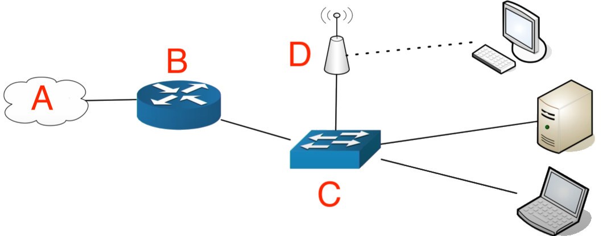
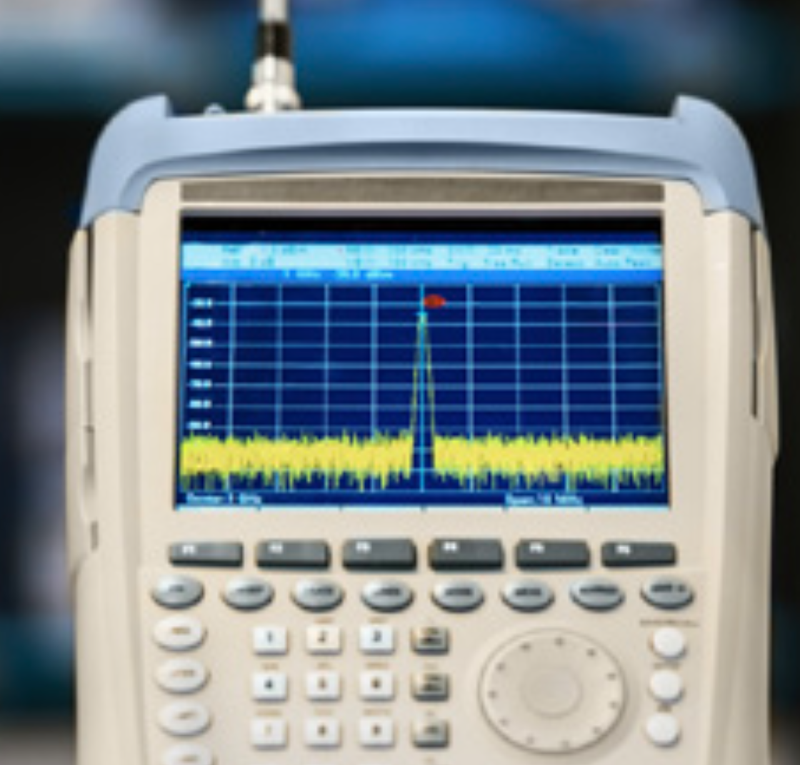
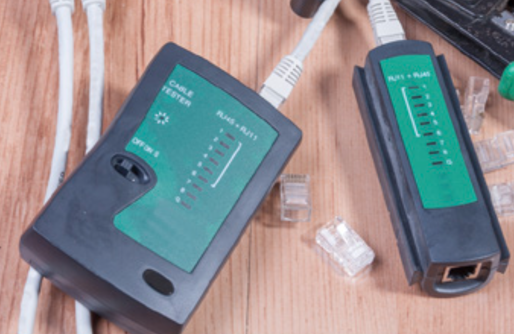
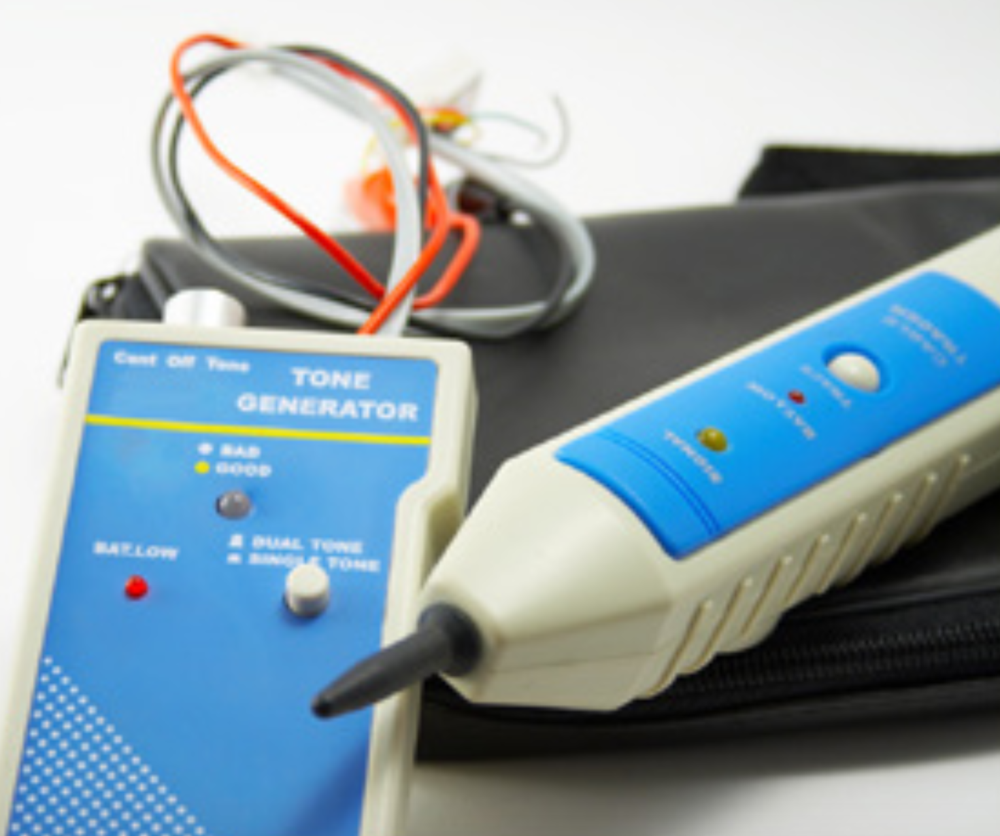
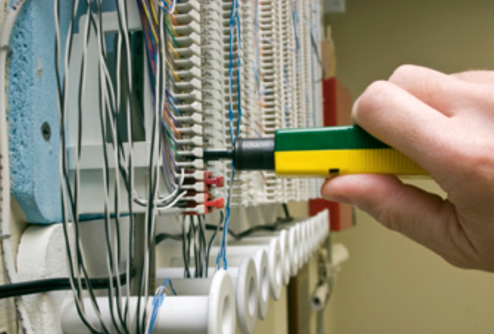
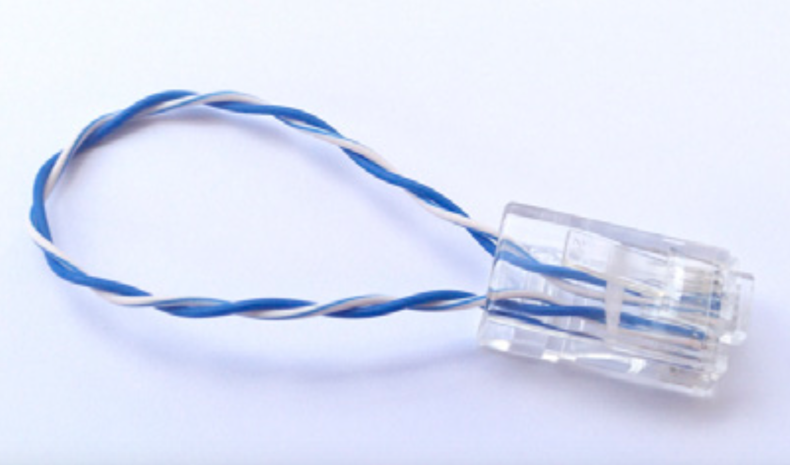
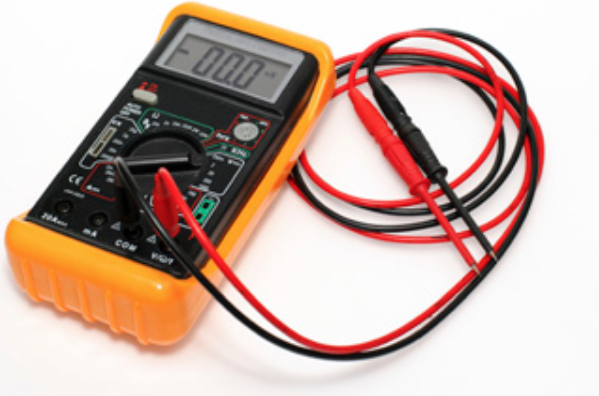

# Assignment 02: Week 02

Before attempting this assignment, please make sure you have completed all of the material in the lessons tab.

Create a copy of this google document [lastname_A02](https://docs.google.com/document/d/1uNrQ8GuiFRrG-cR1NZMDvbxTtDuBnjJjTh_-Fymt__o/edit?usp=sharing) (File > Make a Copy) to record all of your assignment answers in.

> :warning: Failure to use answer document properly will result in a 10pt deduction from final score.

The table of contents for this lab is found below.

&nbsp;&nbsp;&nbsp;&nbsp;&nbsp;&nbsp; Part 1: Introduction to IP, Common Network Ports, Network Devices  
&nbsp;&nbsp;&nbsp;&nbsp;&nbsp;&nbsp; Part 2: 802.11 Wireless Standards, Wireless and Cellular Network Technologies   
&nbsp;&nbsp;&nbsp;&nbsp;&nbsp;&nbsp; Part 3: Network Services, IPv4/IPv6, Network Types and Tools  
&nbsp;&nbsp;&nbsp;&nbsp;&nbsp;&nbsp; Part 4: Submission  

## Part 1: Introduction to IP, Common Network Ports, Network Devices

:interrobang: Question 1 - What does IP stand for? How would you describe what IP is?  

:interrobang: Question 2 - What analogy was used in lecture to describe how IP / TCP / UDP works?  

:interrobang: Question 3 - Define TCP and UDP. How do TCP and UDP differ?  

:interrobang: Question 4 - Consider the below Ethernet packet of data using IP to send a TCP payload of HTTP information. Label each region using the following labels.`IP`,`Ethernet Trailer`,`HTTP Data`,`Ethernet Header`,`TCP`.

* Label A = `_______`
* Label B = `_______`
* Label C = `_______`
* Label D = `_______`
* Label E = `_______`

:interrobang: Question 5 - Define the term (networking) port?  

:interrobang: Question 6 - TCP/UDP port numbers for the below services and protocols:  

<table border="0">
 <tr>
    <td><b style="font-size:30px"></b></td>
    <td><b style="font-size:30px"></b></td>
 </tr>
 <tr>
    <td> FTP   SSH   Telnet   SMTP   DNS   HTTP   HTTPS   LDAP </td>
    <td>POP   IMAP   RDP  SMB   AFP    DHCP   SNMP</td>
 </tr>
</table>

:interrobang: Question 7 - What function does a network interface card provide to a network?  

:interrobang: Question 8 - What function does a repeater provide to a network?  

:interrobang: Question 9 - What function does a hub provide to a network? 

:interrobang: Question 10 - What function does a bridge provide to a network? 

:interrobang: Question 11 - What function does a switch provide to a network? 

:interrobang: Question 12 -  What function does a router provide to a network? 

:interrobang: Question 13 -  What function does a wireless access point provide to a network? 

:interrobang: Question 14 -  What function does a wireless LAN controller provide to a network? 

:interrobang: Question 15 -  What function does a firewall provide to a network? 

:interrobang: Question 16 -  What function does a cable modem provide to a network? 

:interrobang: Question 17 - Consider the network diagram below. Label each region using the following labels. `Switch`,`Router`,`Internet`,`Access Point`.

Label A = `_______`  
Label B = `_______`  
Label C = `_______`  
Label D = `_______`  

:interrobang: Question 21 - Define the below terms:

* Internet
* Router
* Switch
* Access Point

:interrobang: Question 18 - What is a SOHO router? What types of services do SOHO routers provide? 

:interrobang: Question 19 - If you sign up for internet with an internet service provider (ISP), what device are you likely to receive in the mail to connect to the internet?  

:interrobang: Question 20 - How do switching and routing network traffic differ? 

## Part 2: 802.11 Wireless Standards, Wireless and Cellular Network Technologies

:interrobang: Question 21 - What are two common wireless access point frequencies?  

:interrobang: Question 22 - How do 2.4 GHz and 5 GHz differ?  

:interrobang: Question 23 - What does SSID stand for and what does it mean?  

:interrobang: Question 24 - Define NAT in detail.  

:interrobang: Question 25 - What is whitelist/blacklist filtering?  

:interrobang: Question 26 - What is a MAC address? How does it differ from an IP address?  

:interrobang: Question 27 - What is the 802.11 standard? 

:interrobang: Question 28 - What is the most current 802.11 standard used today?  

:interrobang: Question 29 - Provide some common applications RFID chips are used for.  

:interrobang: Question 30 - Mobile payment technologies use a wireless technology called `__________` 

:interrobang: Question 31 - 2G, 3G, 4G, and 5G are all examples of `______` networks.  

## Part 3: Network Services, IPv4/IPv6, Network Types and Tools

:interrobang: Question 32 - In your own words, describe what a server is. 

:interrobang: Question 33 - Provide a brief definition/description of the service provided by each of the below servers (that is, what does each server type do?). 

<table border="0">
 <tr>
    <td><b style="font-size:30px"></b></td>
    <td><b style="font-size:30px"></b></td>
 </tr>
 <tr>
    <td> Web server   File server   Print server   DHCP server   DNS server   </td>
    <td>POP   IMAP   Authentication server   Mail server   Proxy server   </td>
 </tr>
</table>

:interrobang: Question 34 - Provide a brief definition/description for each of the below network services.  

<table border="0">
 <tr>
    <td><b style="font-size:30px"></b></td>
    <td><b style="font-size:30px"></b></td>
 </tr>
 <tr>
    <td> Syslog   IDS   IPS   Legacy System  </td>
    <td>All-in-one Security Appliance   Endpoint Management Server   Embedded Systems  </td>
 </tr>
</table>

:interrobang: Question 35 - What two pieces of information does an IPv4 address tell you?  

:interrobang: Question 36 - Define the term: subnet mask?  

:interrobang: Question 37 - Define the term: default gateway  

:interrobang: Question 38 - IP address can be assigned to devices `________` or `________`.  

:interrobang: Question 39 - How do IPv4 and IPv6 address differ? How can you tell the two apart?  

:interrobang: Question 40 - How do LANs differ from VLANs? 

:interrobang: Question 41 - Provide a brief definition/description for the below network types.  

<table border="0">
 <tr>
    <td><b style="font-size:30px"></b></td>
    <td><b style="font-size:30px"></b></td>
 </tr>
 <tr>
    <td> LAN   PAN  </td>
    <td>WAN  WMN   </td>
 </tr>
</table>

:interrobang: Question 42 - Label the below images with the correct hardware tool name and the function of that tool.  

| Image A             |  Image B |
:-------------------------:|:-------------------------:
  |  

| Image C             |  Image D |
:-------------------------:|:-------------------------:
  |  

| Image E             |  Image F |
:-------------------------:|:-------------------------:
  |  

| Image G             |  
:-------------------------:|
  |  
 

* Image A - 
* Image B - 
* Image C - 
* Image D - 
* Image E - 
* Image F - 
* Image G - 

## Part 3: Submission

Export your answer document to a .PDF and upload a single `lastname_A02.pdf` answer document containing all of your answers to the lab questions to Brightspace through the attachment uploads option.
