# Assignment 03: Week 03

Before attempting this assignment, please make sure you have completed all of the material in the lessons tab.

Create a copy of this google document [lastname_A03](https://docs.google.com/document/d/13HNzICHA4saPEbpI6RLEMGbIljTbjc1czMQF5sH0D6A/edit?usp=sharing) (File > Make a Copy) to record all of your assignment answers in.

> :warning: Failure to use answer document properly will result in a 10pt deduction from final score.

The table of contents for this lab is found below.

&nbsp;&nbsp;&nbsp;&nbsp;&nbsp;&nbsp; Part 1: Cables: Copper, Fiber, Video  
&nbsp;&nbsp;&nbsp;&nbsp;&nbsp;&nbsp; Part 2: Cables: Multipurpose, SATA, Adapters, Converters, Connectors  
&nbsp;&nbsp;&nbsp;&nbsp;&nbsp;&nbsp; Part 3: Primary Memory, Secondary Memory 
&nbsp;&nbsp;&nbsp;&nbsp;&nbsp;&nbsp; Part 4: Motherboard Form Factor and Features, BIOS Options and Security  
&nbsp;&nbsp;&nbsp;&nbsp;&nbsp;&nbsp; Part 5: Submission  

## Part 1: Cables: Copper, Fiber, Video

:interrobang: Question 1 - What is the reason for twisting copper cabling pairs?  

:interrobang: Question 2 - EIA and TIA are organizations that define cabling `__________`.  

:interrobang: Question 3 -  Fill out the table below with the appropriate cable categories:  

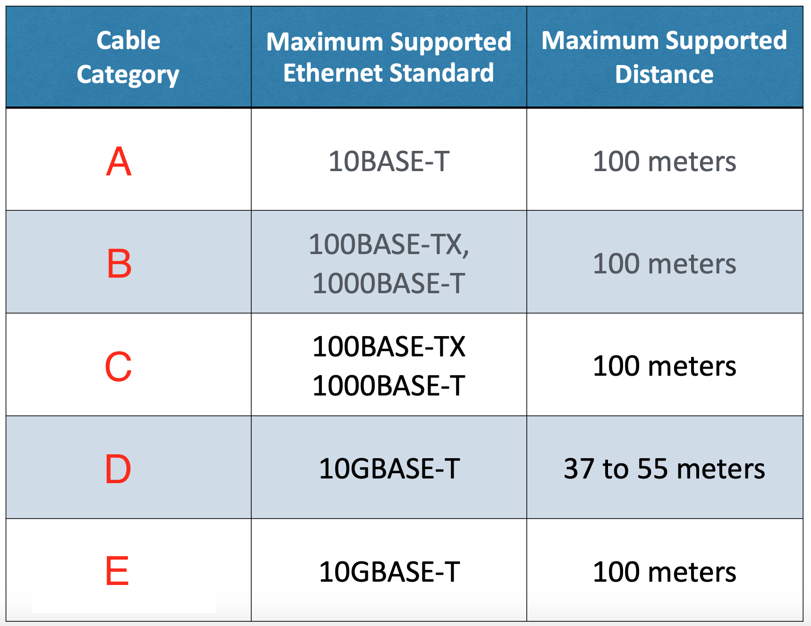

* Label A:
* Label B:
* Label C:
* Label D:
* Label E:

:interrobang: Question 4 - Where should plenum-rated cable be used for? Why?  

:interrobang: Question 5 - What is the main differences between UTP and STP cable types?   

:interrobang: Question 6 - What do the below cable abbreviations stand for?  

* U = `__________`
* S = `__________`
* F = `__________`

:interrobang: Question 7 - Cable notation uses the following format: (`__________`) / (`__________`)TP   

:interrobang: Question 8 - The cable code for a cable where foil is around the cable and no shielding
around the pairs is : `__________`   

:interrobang: Question 9 - The cable code for for a cable with braided shielding around the entire cable
and foil around the pairs is : `__________`    

:interrobang: Question 10 - It is common to see coaxial cables for what application?   

:interrobang: Question 11 - What are the two coaxial cable types you'll commonly see?  

:interrobang: Question 12 - Label the parts of the below coaxial cable:   

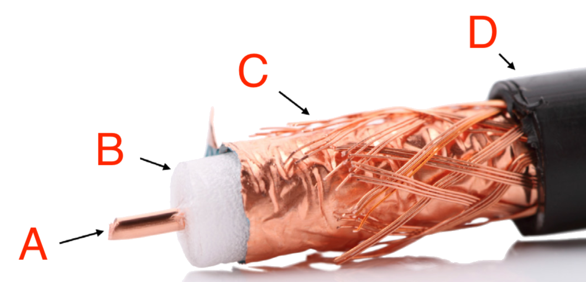

* Label A:
* Label B:
* Label C:
* Label D:

:interrobang: Question 13 - Identify the copper termination standards below:  

> Notice how the twisted pair cables are unwound and set at the termination point - setting the out-pin configuration. This graphic does a nice job keeping track of those twisted pairs once unwound.

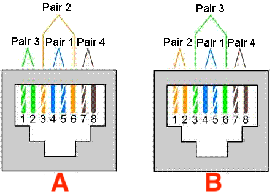

* Label A = `_______`  
* Label B = `_______`  

:interrobang: Question 14 - Optical fiber uses `_______` as a signal medium.  

:interrobang: Question 15 - Label the different components of the optical fiber cable below:  

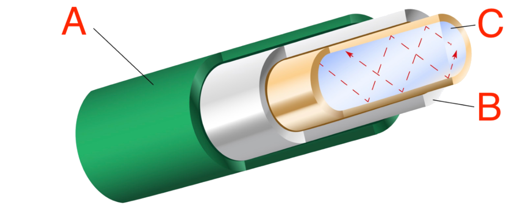

:interrobang: Question 16 - Identify the two different optical fiber cable modes depicted below. Provide a short summary (range / relative cost) of each:   

| Image A             |  Image B |
:-------------------------:|:-------------------------:
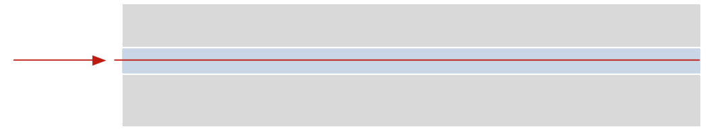  |  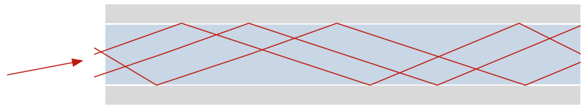

* Image A = `_______`  
* Image B = `_______`  

:interrobang: Question 17 - What are two common light sources used in fiber optic communication?  

:interrobang: Question 18 - Identify the below video cables types/connectors and a brief description of it's use case:  

| Image A             |  Image B |
:-------------------------:|:-------------------------:
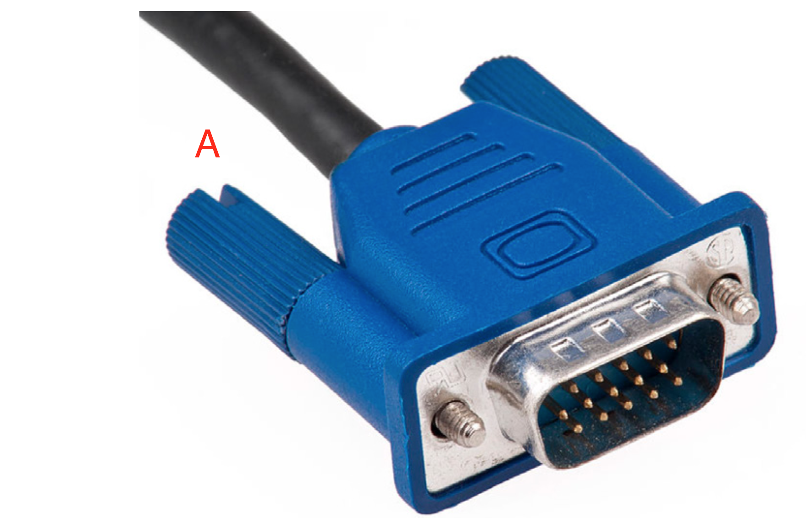  |  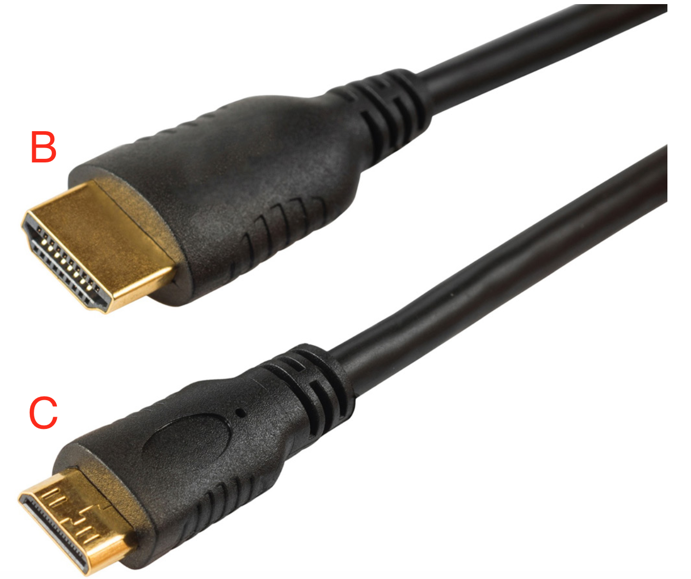

| Image C             |  Image D |
:-------------------------:|:-------------------------:
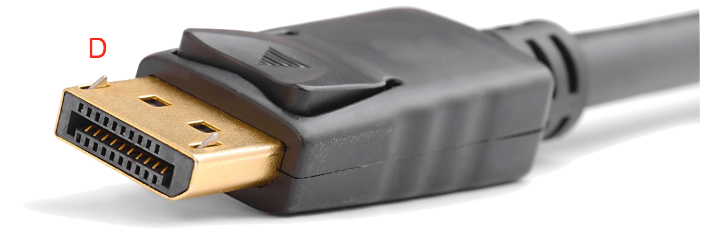  |  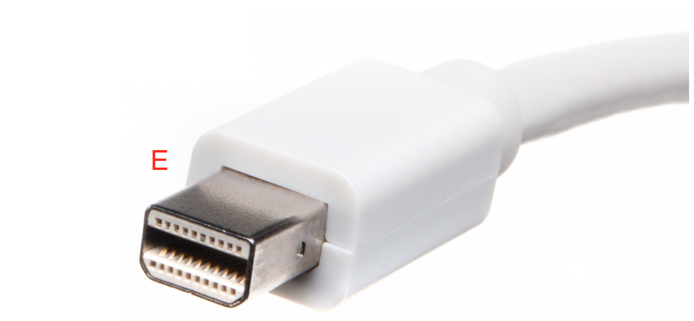

| Image E             |
:-------------------------:|
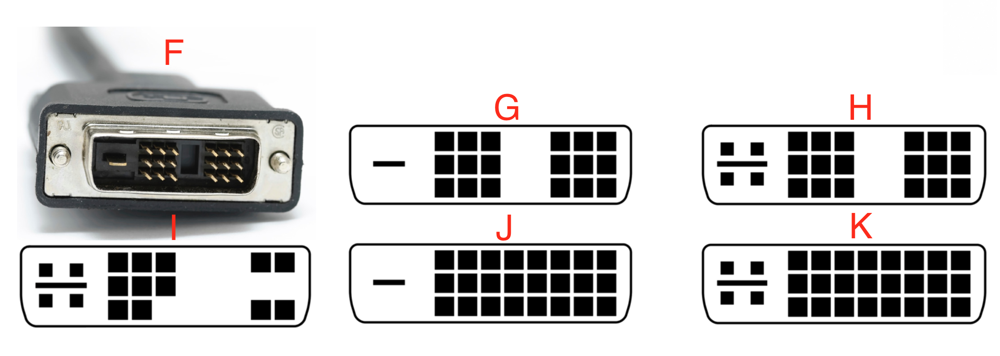  |

* Label A:
* Label B:
* Label C:
* Label D:
* Label E:
* Label F:
* Label G:
* Label H:
* Label I:
* Label J:
* Label K:

## Part 2: Cables: Multipurpose, SATA, Adapters, Converters, Connectors 

:interrobang: Question 19 - Identify the below multipurpose cables and a brief description of it's use case: 

| Image A             |  Image B | Image C |
:-------------------------:|:-------------------------:|:-------------------------:
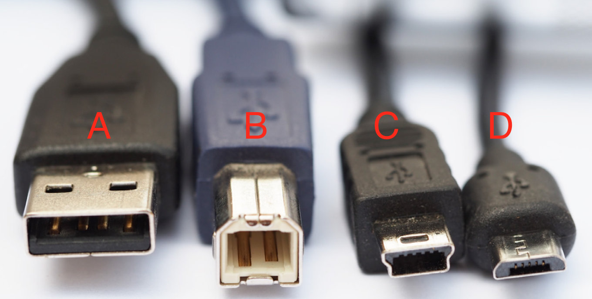  |  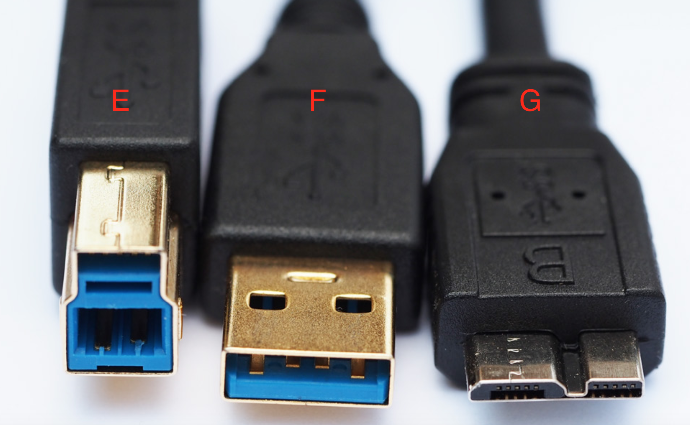|  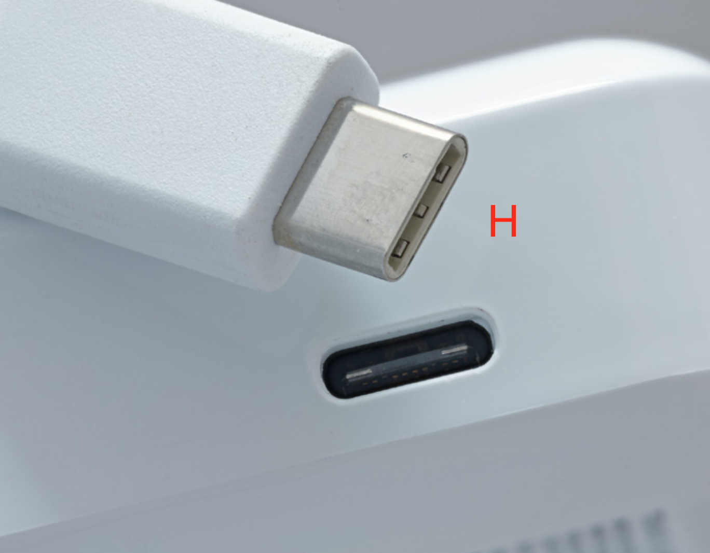

| Image D             |  Image E |
:-------------------------:|:-------------------------:
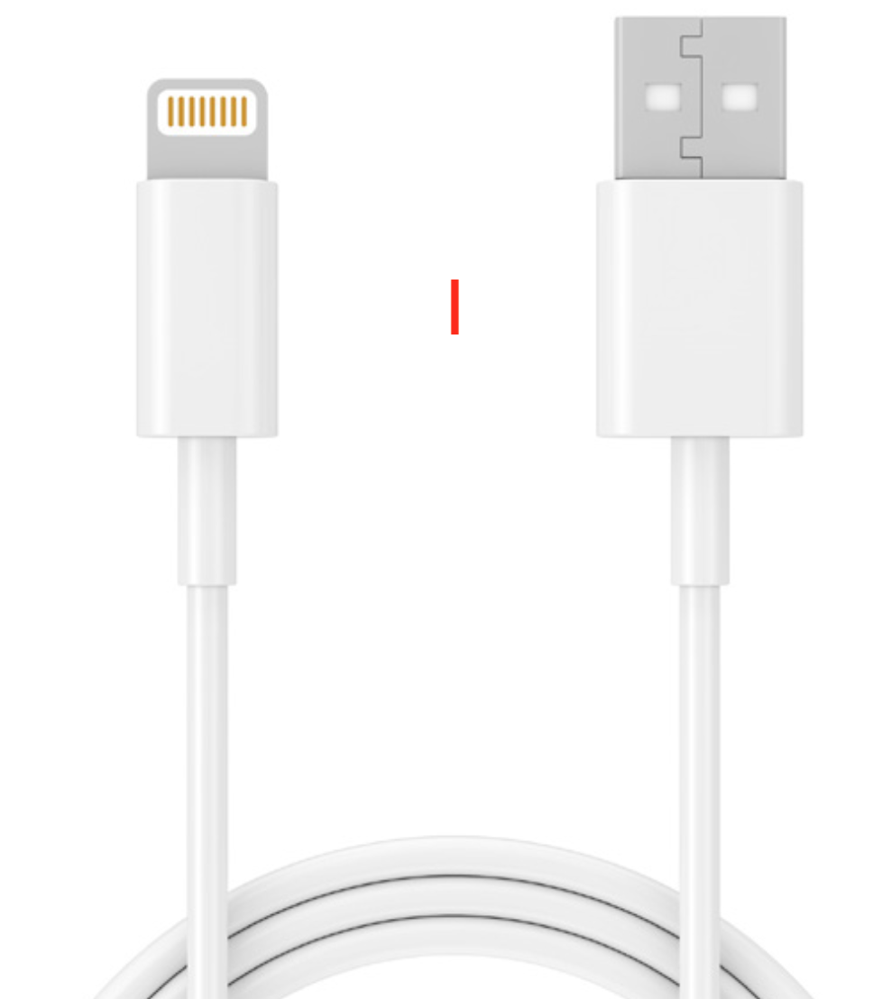  |  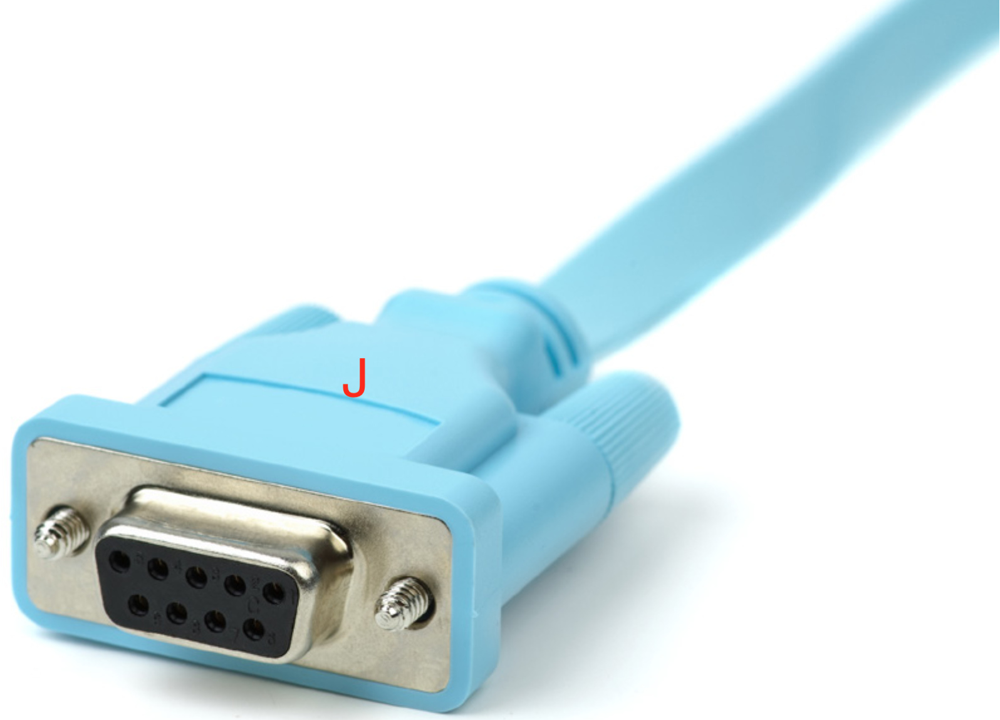

* Label A:
* Label B:
* Label C:
* Label D:
* Label E:
* Label F:
* Label G:
* Label H:
* Label I:
* Label J:

:interrobang: Question 20 - What are SATA power / data cables used for and what hardware components are we likely to see SATA connectors on?  

:interrobang: Question 21 - What does SCSI stand for?  

:interrobang: Question 22 - What would you need to connect a DVI cable to a machine that only has an HDMI port? 

:interrobang: Question 23 -  Identify the below connectors and a brief description of its use case: 

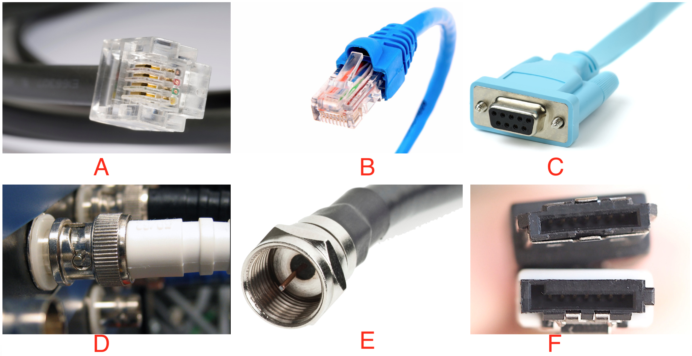

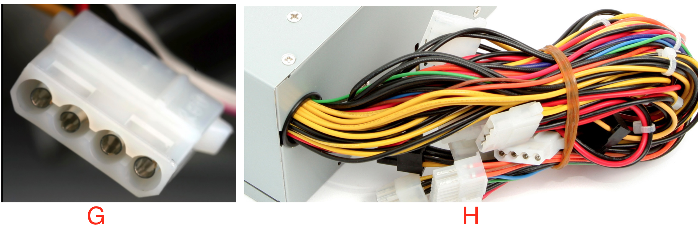

## Part 3: Primary Memory, Secondary Memory

:interrobang: Question 24 - In your own words, describe what the below image is depicting?  

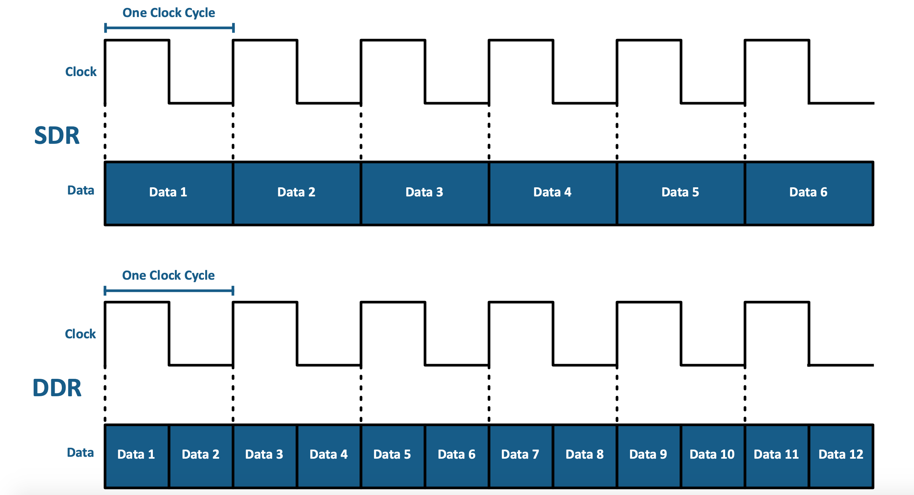

:interrobang: Question 25 - Define the term primary memory (RAM).  

:interrobang: Question 26 - How do SDR and DDR ram types differ?  

:interrobang: Question 27 - CD-ROM, DVD-ROM, and Blu-ray disk are forms of `_______` storage.  

:interrobang: Question 28 - To write data to optical formats, you'll need `_______` , `_______` , `_______` , `_______` , or `_______` depending on the disk format.  

:interrobang: Question 29 - How do HDD and SSD storage formats differ?  

:interrobang: Question 30 - If a storage device does not require power to retain its data, we call this `_______`.  

:interrobang: Question 31 - How do storage devices (secondary memory) differ from RAM (primary memory)?  

:interrobang: Question 32 -  What does RAID stand when discussing secondary memory storage options.  

:interrobang: Question 33 -  What does RAID provide for our data storage efforts?  

:interrobang: Question 34 -  What is a "hot swappable drive"? 

## Part 4: Motherboard Form Factor and Features, BIOS Options and Security

:interrobang: Question 35 -  List the four factors discussed this week in lecture that are important when considering the motherboard form.  

:interrobang: Question 36 - Define the term: *computer bus*.  

:interrobang: Question 37 - Define the term: *expansion bus*.  

:interrobang: Question 38 -  What does PCI stand for and what is it?  

:interrobang: Question 39 - What is a CPU socket?  

:interrobang: Question 40 - What does BIOS stand for and what is it used for?  

:interrobang: Question 41 - Compare Legacy BIOS vs UEFI BIOS.  

:interrobang: Question 42 -  Describe some advantages UEFI BIOS can provide its users.  

:interrobang: Question 43 - What was the “CMOS” battery? Is it needed in modern computers?  

:interrobang: Question 44 - What are 5 common button combinations to access a machines BIOS at startup?  

:interrobang: Question 45 - In your own words, why is a machines BIOS important?  

:interrobang: Question 46 - What is secure boot?  

:interrobang: Question 47 - When should you consider starting a machine in secure boot?  

:interrobang: Question 48 -  Define the term firmware.  

:interrobang: Question 49 -  Is BIOS a type of firmware?  

:interrobang: Question 50 - List some pros and cons of updating a systems BIOS?  

## Part 5: Submission

Export your answer document to a .PDF and upload a single `lastname_A03.pdf` answer document containing all of your answers to the lab questions to Brightspace through the attachment uploads option.
