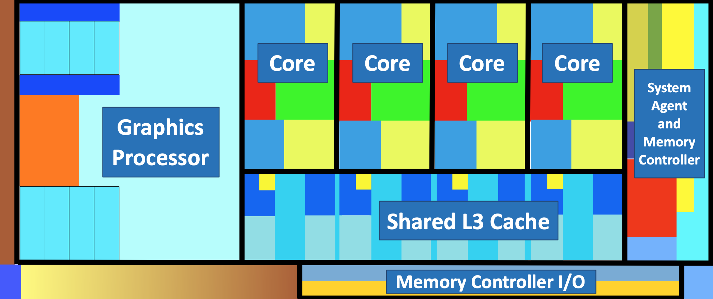
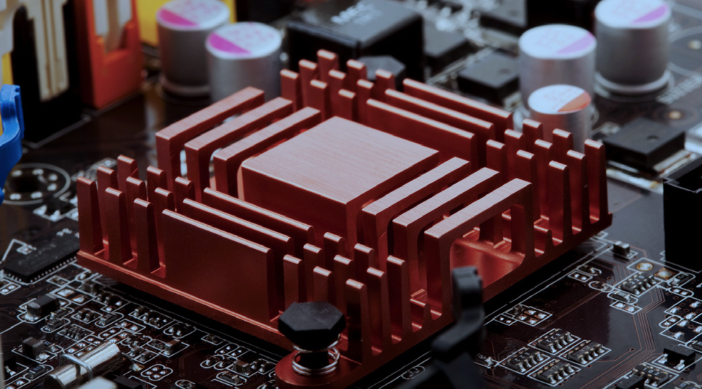

# Assignment 04: Week 04

Before attempting this assignment, please make sure you have completed all of the material in the lessons tab.

Create a copy of this google document [lastname_A04](https://docs.google.com/document/d/1teH6OweucIn5w_cNkzRb6ljy5V7hY3l9gV2R-0qRpEg/edit?usp=sharing)(File > Make a Copy) to record all of your assignment answers in.

> :warning: Failure to use answer document properly will result in a 10pt deduction from final score.

The table of contents for this lab is found below.

&nbsp;&nbsp;&nbsp;&nbsp;&nbsp;&nbsp; Part 1: CPU: Features, Cooling, Expansion Cards  
&nbsp;&nbsp;&nbsp;&nbsp;&nbsp;&nbsp; Part 2: Peripherals, Computer Power, Common Devices, SOHO Multifunction Devices  
&nbsp;&nbsp;&nbsp;&nbsp;&nbsp;&nbsp; Part 3: Printers: Laser, Inkjet, Thermal, 3D  
&nbsp;&nbsp;&nbsp;&nbsp;&nbsp;&nbsp; Part 4: Submission  

## Part 1: CPU: Features, Cooling, Expansion Cards

:interrobang: Question 1 - Define the term: CPU core.  

:interrobang: Question 2 - Define the term: CPU cache.  

:interrobang: Question 3 - Virtualization support allows for the creation of `_______` on a host computer.  

:interrobang: Question 4 - Define the term: hyper-threading.  

:interrobang: Question 5 - How does overclocking relate to processor speed?  

:interrobang: Question 6 - The below figure is the internal representation of a `_____`.  

:interrobang: Question 7 - Discuss some of the cooling options that are available for CPUs.   

:interrobang: Question 8 - What is the image below depicting?  

:interrobang: Question 9 - What are expansion cards used for?  

## Part 2: Peripherals, Computer Power, Common Devices, SOHO Multifunction Devices

:interrobang: Question 10 - Provide a brief definition/description for each of the below peripherals devices.  

<table border="0">
 <tr>
    <td><b style="font-size:30px"></b></td>
    <td><b style="font-size:30px"></b></td>
 </tr>
 <tr>
    <td> Printer   Scanner   Barcode/QR code reader   Display devices (monitors)   VR headset   Speakers </td>
    <td>Mouse   Keyboard   Touch pads   Signature pad   Gaming input   Webcam    Microphone</td>
    <td>Headset   Digital projectors   External storage devices  KVM   Magnetic reader / chip reader   NFC / Tap-to-pay device    Smart card reader</td>
 </tr>
</table>

:interrobang: Question 11 - When working on an electric device, you should always remember to `__________`.  

:interrobang: Question 12 - Define the term: Ampere (amp, A)  

:interrobang: Question 13 -  Define the term: Voltage (volt, V)  

:interrobang: Question 14 -  Define the term: Watt (W)  

:interrobang: Question 15 -  What are the differences between AC and DC voltage?  

:interrobang: Question 16 - What three hardware components/peripherals should you prioritize for a cluster of computers that will be used as a graphics workstation (CAD or CAM). Why?  

:interrobang: Question 17 - What three hardware components/peripherals should you prioritize for a cluster of computers that will be used as a audio/video editing workstation. Why?  

:interrobang: Question 18 -  What two hardware components/peripherals should you prioritize for a cluster of computers that will be used as a virtualization workstation (VM clusters). Why?  

:interrobang: Question 19 - Describe the differences between a thin and thick client.  

## Part 3: Printers: Laser, Inkjet, Thermal, 3D

:interrobang: Question 20 - What services does a SOHO multifunction devices (think home "printer") usually provide?  

:interrobang: Question 21 - What is a printer's driver? Does it need to be specific to the SOHO printer?  

:interrobang: Question 22 -  Provide a brief definition/description for each of the below SOHO printer configuration settings.  

* Duplex
* Collate
* Orientation
* Quality

:interrobang: Question 23 - Provide some pros and cons for using a laser printer.  

:interrobang: Question 24 - Enumerate the 7 step process laser printers undergo to print a document.  

:interrobang: Question 25 - What is a toner cartridge used for?  

:interrobang: Question 26 -  Provide some pros and cons for using an inkjet printer.  

:interrobang: Question 27 -  Provide some pros and cons for using a thermal printer.  

:interrobang: Question 28 -  A mid-sized office (25 - 50 employees) that prints ~ 150 pages a day needs a new printer. Make a printer type recommendation. Be sure to provide your justification for this recommendation. 

:interrobang: Question 29 - What are 3D Printers? What type of material is used in their printing process?  

## Part 4: Submission

Export your answer document to a .PDF and upload a single `lastname_A04.pdf` answer document containing all of your answers to the lab questions to Brightspace through the attachment uploads option.
