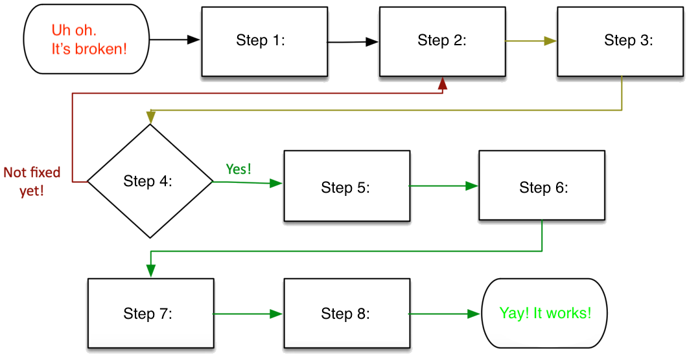

# Assignment 05: Week 05

Before attempting this assignment, please make sure you have completed all of the material in the lessons tab.

Create a copy of this google document [lastname_A05](https://docs.google.com/document/d/1ai52C_wGJ2M5JXghX_I9OtqbFFepSxGP50TwRwjbstg/edit?usp=sharing)(File > Make a Copy) to record all of your assignment answers in.

> :warning: Failure to use answer document properly will result in a 10pt deduction from final score.

The table of contents for this lab is found below.

&nbsp;&nbsp;&nbsp;&nbsp;&nbsp;&nbsp; Part 1: Cloud: Models, Services, and Virtualization  
&nbsp;&nbsp;&nbsp;&nbsp;&nbsp;&nbsp; Part 2: Troubleshooting: Common Hardware Problems,  Hard Drives, Video and Display Issues  
&nbsp;&nbsp;&nbsp;&nbsp;&nbsp;&nbsp; Part 3: Submission  

## Part 1: Part 1: Cloud: Models, Services, and Virtualization

:interrobang: Question 1 - What is "the cloud"?

:interrobang: Question 2 - In your own words, describe the below cloud service models:  

* Infrastructure as a service (IaaS)
* Software as a service (SaaS)
* Platform as a service (PaaS)

:interrobang: Question 3 - Compare and contrast the different cloud deployment models discussed this week (private, public, hybrid).  

:interrobang: Question 4 - Why would an organization want to seek external cloud computing resources?  

:interrobang: Question 5 - What is a virtual desktop infrastructure (VDI)? What security benefits can be recognized by implementing a virtual desktop infrastructure?  

:interrobang: Question 6 - In your own words, describe/define the term virtualization. 

:interrobang: Question 7 - Define the term: hypervisor.  

:interrobang: Question 8 - How does emulation differ from virtualization?  

:interrobang: Question 9 - What is a host OS? What is a guest OS?  

:interrobang: Question 10 - Does virtualizing a machine offer total security from malware that contained in the VM? Why or why not?  

## Part 2: Troubleshooting: Common Hardware Problems,  Hard Drives, Video and Display Issues

:interrobang: Question 11 - Fill out the troubleshooting process flowchart below: 

* Step 1: `______________`
* Step 2: `______________`
* Step 3: `______________`
* Step 4: `______________`
* Step 5: `______________`
* Step 6: `______________`
* Step 7: `______________`
* Step 8: `______________`

:interrobang: Question 12 - Why is it important to closely manage change at an organization?  

:interrobang: Question 13 - What does change to a process or network infrastructure usually introduce?   

:interrobang: Question 14 - Why is documentation *critically important* when implementing change?  

:interrobang: Question 15 - List some common reasons that might be the cause for unexpected shutdowns on a workstation.  

:interrobang: Question 16 - List some common reasons that might be the cause for unexpected lockups/freezing on a workstation.  

:interrobang: Question 17 - List some common reasons that might be the cause for unexpected POST and boot (blank screen on boot) on a workstation.  

:interrobang: Question 18 - List some common reasons that might be the cause for continuous reboots on a workstation.  

:interrobang: Question 19 - List some common reasons that might be the cause for a workstation to not turn on.  

:interrobang: Question 20 - List some common reasons that might be the cause for a workstation to overheat.  

:interrobang: Question 21 - List some common reasons that might be the cause for a workstation that makes loud noises.  

:interrobang: Question 22 - List some common reasons that might be the cause for a workstation to experience intermittent device failure.  

:interrobang: Question 23 - List some common reasons that might be the cause for a workstation to omit a smoke or burning smell. 

:interrobang: Question 24 - What are some common disk failure symptoms?  

:interrobang: Question 25 - If you suspect a disk failure, what are some common troubleshooting steps you should take?  

:interrobang: Question 26 - What are some common boot failure symptoms?  

:interrobang: Question 27 - If you suspect a boot failure, what are some common troubleshooting steps you should take?  

:interrobang: Question 28 - A user is experiencing no video image to their monitor. What should you check to identify the problem?  

:interrobang: Question 29 - What are likely causes for image quality problems (flickering, incorrect color patterns)?  

:interrobang: Question 30 - If images and icons are unintentionally oversized on a workstation, it's likely that the `______________` is set too low.   

## Part 3: Submission

Export your answer document to a .PDF and upload a single `lastname_A05.pdf` answer document containing all of your answers to the lab questions to Brightspace through the attachment uploads option.
