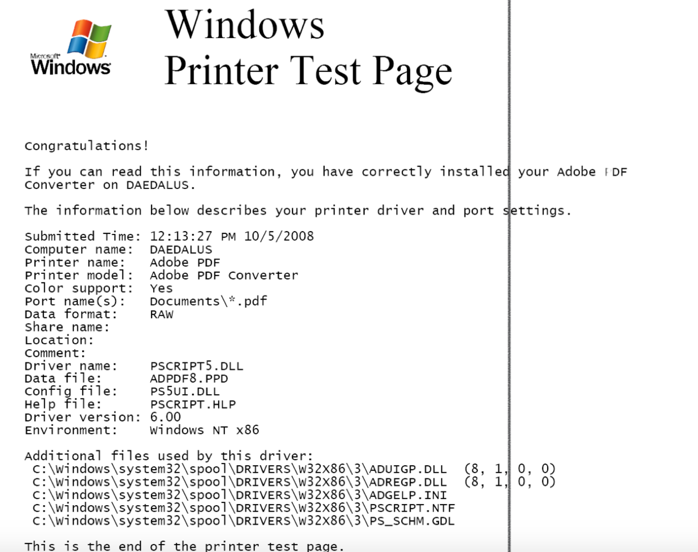
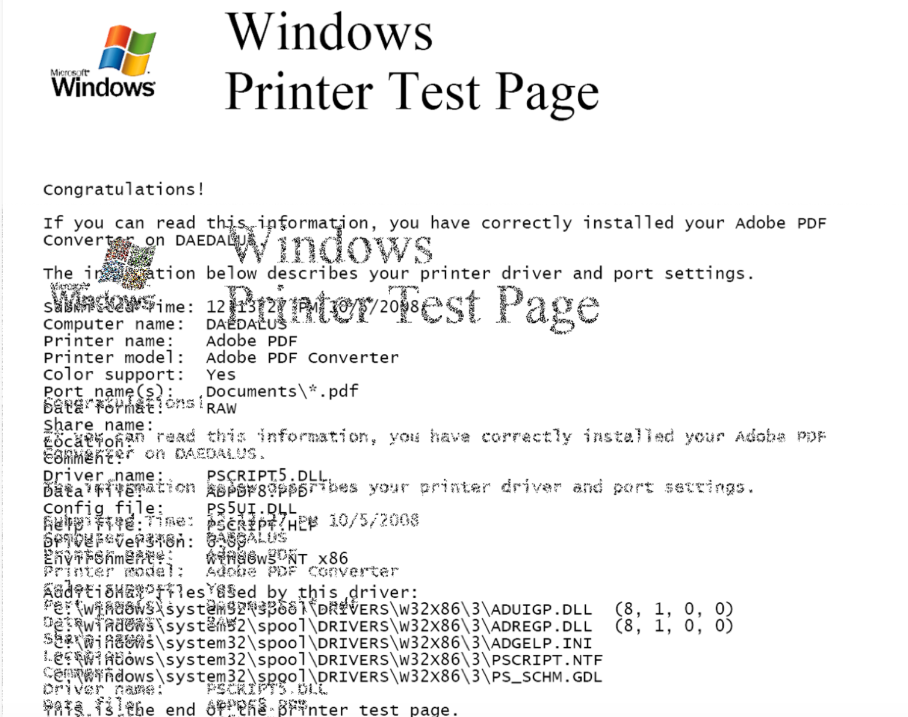

# Assignment 06: Week 06

Before attempting this assignment, please make sure you have completed all of the material in the lessons tab.

Create a copy of this google document [lastname_A06](https://docs.google.com/document/d/1zxRGv5tmlg8pwuzS6jCp0HV_J6UAXrJB7jHg0BfWzHI/edit?usp=sharing)(File > Make a Copy) to record all of your assignment answers in.

> :warning: Failure to use answer document properly will result in a 10pt deduction from final score.

The table of contents for this lab is found below.

&nbsp;&nbsp;&nbsp;&nbsp;&nbsp;&nbsp; Part 1: Troubleshooting: Laptops, Mobile Devices, Device Disassembly Best Practices  
&nbsp;&nbsp;&nbsp;&nbsp;&nbsp;&nbsp; Part 2: Troubleshooting: Printers, Networks  
&nbsp;&nbsp;&nbsp;&nbsp;&nbsp;&nbsp; Part 3: Submission  

## Part 1: Troubleshooting: Laptops, Mobile Devices, Device Disassembly Best Practices

:interrobang: Question 1 - What should you do to troubleshoot a laptop with a failing display?   

:interrobang: Question 2 - What should you do to troubleshoot a laptop with a intermittent wireless connection?   

:interrobang: Question 3 - What should you do to troubleshoot a laptop with a power issues (battery not charging / no power)?  

:interrobang: Question 4 - What should you do to troubleshoot a mobile device with a non-responsive touch screen? 

:interrobang: Question 5 - What should you do to troubleshoot a mobile device with a problematic application (not loading / poor performance)? 

:interrobang: Question 6 - What can cause a mobile device to have a short battery life? 

:interrobang: Question 7 - What should you do in the event that a mobile device completely freezes (no screen or button response)?  

:interrobang: Question 8 - How should you deal with a battery thats swollen? What risk does a swollen battery pose?  

:interrobang: Question 9 - Define some helpful strategies/procedures to follow when disassembling a device.  

## Part 2: Troubleshooting: Printers, Networks

:interrobang: Question 10 - When a printer has streaks and blurs in it's output, what should you do (Inkjet vs Laser)?   

:interrobang: Question 11 - When a printer produces faded prints or blank pages, what is likely the cause?   

:interrobang: Question 12 - What are some common causes of a paper jam when printing?  

:interrobang: Question 13 - When a printer produces a bad output (garbled characters), what is likely the cause? 

:interrobang: Question 14 - If you're unable to instal a printers drivers on a workstation, what are some things that you should troubleshoot?  

:interrobang: Question 15 - The below image depicts what type of printer problem? 

:interrobang: Question 16 - The below image depicts what type of printer problem? 

:interrobang: Question 17 - The below image depicts what type of printer problem? 

:interrobang: Question 18 - List 5 things you should check when troubleshooting a workstation with no network connectivity.  

:interrobang: Question 19 - How should you resolve a "Limited or No connectivity" alert in windows?  

:interrobang: Question 20 - What are some causes of intermittent internet connectivity?   

:interrobang: Question 21 - What is an IP conflict?  

:interrobang: Question 22 - How can you mitigate slow transfer/connection speeds?  

:interrobang: Question 23 - What types of devices / fixtures in an office can cause wireless interference?   

:interrobang: Question 24 - What might cause your network's SSID to not be found / become undetectable?  

## Part 3: Submission

Export your answer document to a .PDF and upload a single `lastname_A06.pdf` answer document containing all of your answers to the lab questions to Brightspace through the attachment uploads option.
