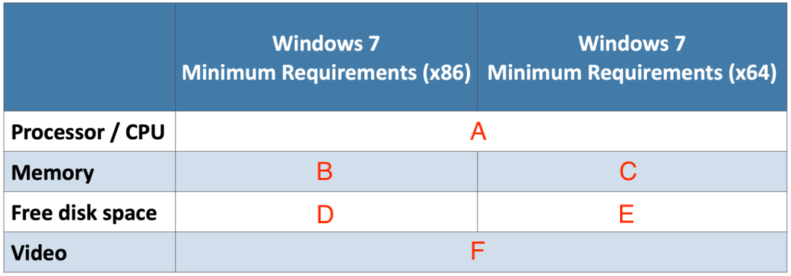
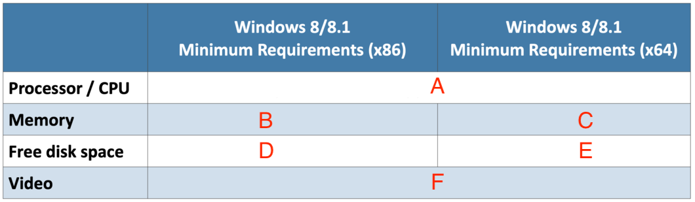
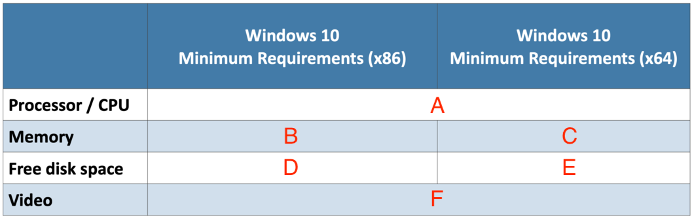

# Assignment 07: Week 07

Before attempting this assignment, please make sure you have completed all of the material in the lessons tab.

Create a copy of this google document [lastname_A07](https://docs.google.com/document/d/1ggbaq0Sq77pBpPB2w630mpDxGeOrNlABuJLzoXPafpI/edit?usp=sharing)(File > Make a Copy) to record all of your assignment answers in.

> :warning: Failure to use answer document properly will result in a 10pt deduction from final score.

The table of contents for this lab is found below.

&nbsp;&nbsp;&nbsp;&nbsp;&nbsp;&nbsp; Part 1: Windows 7, 8, 10  
&nbsp;&nbsp;&nbsp;&nbsp;&nbsp;&nbsp; Part 2: Microsoft Network, Administrative, and Command Line Tools  
&nbsp;&nbsp;&nbsp;&nbsp;&nbsp;&nbsp; Part 3: Submission  

## Part 1: Windows 7, 8, 10

:interrobang: Question 1 - Why do you need an operating system?  

:interrobang: Question 2 - What are some standard operating system features?  

:interrobang: Question 3 - Which operating system has the most market presence?  

:interrobang: Question 4 - List some advantages and disadvantages for using Microsoft Windows. 

:interrobang: Question 5 - List some advantages and disadvantages for using macOS. 

:interrobang: Question 6 - List some advantages and disadvantages for using Linux. 

:interrobang: Question 7 - What is the difference between a 32-bit vs. 64-bit operating system?  

:interrobang: Question 8 - Name four common mobile operating systems.  

:interrobang: Question 9 - What are the six main versions of Windows 7?  

:interrobang: Question 10 - Is Windows 7 still supported by Microsoft today? 

:interrobang: Question 11 -  What are some main differences between Windows 7 and Windows 8? 

:interrobang: Question 12 -  What are some main differences between Windows 8 and Windows 10? 

:interrobang: Question 13 -  Fill out the minimum specifications for each operating system listed below:  

#### Windows 7

* label A: `__________`
* label B: `__________`
* label C: `__________`
* label D: `__________`
* label E: `__________`
* label F: `__________`

#### Windows 8 / 8.1

* label A: `__________`
* label B: `__________`
* label C: `__________`
* label D: `__________`
* label E: `__________`
* label F: `__________`

#### Windows 10

* label A: `__________`
* label B: `__________`
* label C: `__________`
* label D: `__________`
* label E: `__________`
* label F: `__________`

:interrobang: Question 14 - What are BitLocker and EFS used for?  

:interrobang: Question 15 -  What is the Windows 10 feature Active Directory Domain Services?  

:interrobang: Question 16 - What are some some different boot methods that we can use to install a fresh operating system on a machine?  

:interrobang: Question 17 -  Define the differnt types if OS installs below: 

* Unattended installation
* In-place upgrade
* Clean install
* Image
* Repair installation
* Multiboot
* Recovery partition
* Refresh / restore

:interrobang: Question 18 - What is a disk partition?  

:interrobang: Question 19 -  What is the MBR and the different between Primary vs Extended?  

:interrobang: Question 20 -  How do Basic disk storage and Dynamic disk storage differ? 

:interrobang: Question 21 - Describe what a file system is.  

:interrobang: Question 22 - How does the FAT32 file system differ from NTFS?  

:interrobang: Question 23 - Which is more secure ~ Quick Format vs. Full Format? Why?  

:interrobang: Question 24 - What is Windows CMD?  

:interrobang: Question 25 - What are Windows user privileges? What are the different Windows privileges classifications?  

## Part 2: Microsoft Network, Administrative, and Command Line Tools

:interrobang: Question 26 - Describe what each of the below Windows terminal commands / tools does:  

<table border="0">
 <tr>
    <td><b style="font-size:30px"></b></td>
    <td><b style="font-size:30px"></b></td>
    <td><b style="font-size:30px"></b></td>
    <td><b style="font-size:30px"></b></td>
 </tr>
 <tr>
    <td> help dir   help chkdsk   [command] /?   exit   dir   cd   ..   shutdown </td>
    <td>shutdown /s /t nn   shutdown /r /t nn   shutdown /a  dism   sfc    sfc /scannow   chkdsk /f</td>
    <td>chkdsk /r   diskpart   tasklist  taskkill   TASKKILL /IM notepad.exe    TASKKILL /PID 1234 /T   gpupdate</td>
    <td>gpresult   format c:   copy (/v, /y)  xcopy /s Documents m:\backups </td>
 </tr>
</table>

:interrobang: Question 27 - Describe what each of the below Windows network terminal commands / tools does:  

<table border="0">
 <tr>
    <td><b style="font-size:30px"></b></td>
    <td><b style="font-size:30px"></b></td>

 </tr>
 <tr>
    <td> ipconfig   ping   tracert  netstat   netstat -a   netstat -b   netstat -n   nslookup </td>
    <td>net   net view \\&ltservername&gt   net view /workgroup:&ltworkgroupname&gt   net user &ltusername&gt   net user &ltusername&gt * /domain    net use h: \\&ltservername&gt\&ltsharename&gt</td>

 </tr>
</table>

:interrobang: Question 28 - Describe what each of the below Windows administrative tools are used for:  

<table border="0">
 <tr>
    <td><b style="font-size:30px"></b></td>
    <td><b style="font-size:30px"></b></td>

 </tr>
 <tr>
    <td> Computer Management   Device Manager   Local users and groups  Local Security Policy   Performance Monitor   Services  </td>
    <td>ODBC Data Sources   Print Management   Memory diagnostics   Event Viewer  Task Scheduler   Component Services </td>

 </tr>
</table>

:interrobang: Question 29 - What is Windows Defender?   

:interrobang: Question 30 - What are firewall inbound rules?  

:interrobang: Question 31 -  What are firewall outbound rules?  

:interrobang: Question 32 -  What is a firewall ACL?  

:interrobang: Question 33 -  Can you block individual programs and protocols in Windows defender?  

## Part 3: Submission

Export your answer document to a .PDF and upload a single `lastname_A07.pdf` answer document containing all of your answers to the lab questions to Brightspace through the attachment uploads option.
