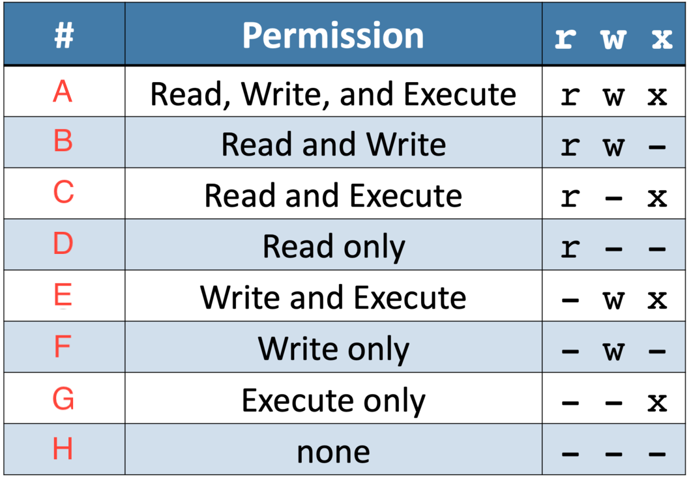

# Assignment 09: Week 09

Before attempting this assignment, please make sure you have completed all of the material in the lessons tab.

Create a copy of this google document [lastname_A09](https://docs.google.com/document/d/1qNfxKzP33FN1I0kRJwBluY3Nvf8lTCdwFtKuNq3XYfQ/edit?usp=sharing)(File > Make a Copy) to record all of your assignment answers in.

> :warning: Failure to use answer document properly will result in a 10pt deduction from final score.

The table of contents for this lab is found below.

&nbsp;&nbsp;&nbsp;&nbsp;&nbsp;&nbsp; Part 1: Windows: IP Address Configuration and Network Adapter Properties  
&nbsp;&nbsp;&nbsp;&nbsp;&nbsp;&nbsp; Part 2: macOS: Best Practices, Tools  
&nbsp;&nbsp;&nbsp;&nbsp;&nbsp;&nbsp; Part 3: Submission  

## Part 1: Windows: IP Address Configuration and Network Adapter Properties

:interrobang: Question 1 - What does DHCP stand for and what does it do?  

:interrobang: Question 2 - What does APIPA stand for and what does it do?  

:interrobang: Question 3 - How does static addressing differ from DHCP?  

:interrobang: Question 4 - Define the term: IP Address.  

:interrobang: Question 5 - Define the term: Subnet Mask. 

:interrobang: Question 6 - Define the term: Gateway. 

:interrobang: Question 7 - What does link speed describe?  

:interrobang: Question 8 - What does duplex mean?  

:interrobang: Question 9 - QoS stands for `_________`.  

## Part 2: macOS: Best Practices, Tools

:interrobang: Question 10 - What does the macOS Time Machine do?  

:interrobang: Question 11 - Can you perform centralized updates for apps and OS systems in macOS?  

:interrobang: Question 12 - Does macOS have an included anti-virus or anti-malware software? If yes, what is it called. If not, what can macOS users use instead?  

:interrobang: Question 13 - Do macOS need to manually update driver/firmware updates?  

:interrobang: Question 14 - What does image recovery do in macOS?  

:interrobang: Question 15 - What major functions can you perform in macOS's Disk Utility tool?  

:interrobang: Question 16 - What does the macOS Keychain do?  

:interrobang: Question 17 - What is macOS Spotlight used for?  

:interrobang: Question 18 - What is macOS's iCloud?  

:interrobang: Question 19 - What is the macOS Finder? What are the things you can do in Finder?  

:interrobang: Question 20 - What is the macOS Dock?  

## Part 3: Linux: Best Practices, Tools

:interrobang: Question 21 - What do the Linux command line tools `apt-get` and `yum` do?  

:interrobang: Question 22 - What does the Linux command ` rsync` do?  

:interrobang: Question 23 - Does Linux have any image recovery tools? If so, name it/them. 

:interrobang: Question 24 - What Linux directory are disk maintenance logs stored in?   

:interrobang: Question 25 - What does the Linux command `sudo touch /forcefsck` do?  

:interrobang: Question 26 - Describe what the below Linux commands do:  

<table border="0">
 <tr>
    <td><b style="font-size:30px"></b></td>
    <td><b style="font-size:30px"></b></td>
    <td><b style="font-size:30px"></b></td>
    <td><b style="font-size:30px"></b></td>
    <td><b style="font-size:30px"></b></td>

 </tr>
 <tr>
    <td> grep   cd   shutdown   sudo shutdown -r 2   pwd   passwd </td>
    <td> mv   cp   rm   mkdir   chmod   chmod 744 first.txt </td>
    <td> chmod a-w first.txt   chown   iwconfig   ifconfig   ps   ps -e | more </td>
    <td> su   sudo   apt-get   vi   i (while in vi)   :wq (while in vi)</td>
    <td> dd   killall </td>

 </tr>
</table>

:interrobang: Question 27 - Fill out the below permission table key:  

Label A: `_______`   
Label B: `_______`   
Label C: `_______`   
Label D: `_______`   
Label E: `_______`   
Label F: `_______`   
Label G: `_______`   

## Part 3: Submission

Export your answer document to a .PDF and upload a single `lastname_A09.pdf` answer document containing all of your answers to the lab questions to Brightspace through the attachment uploads option.
