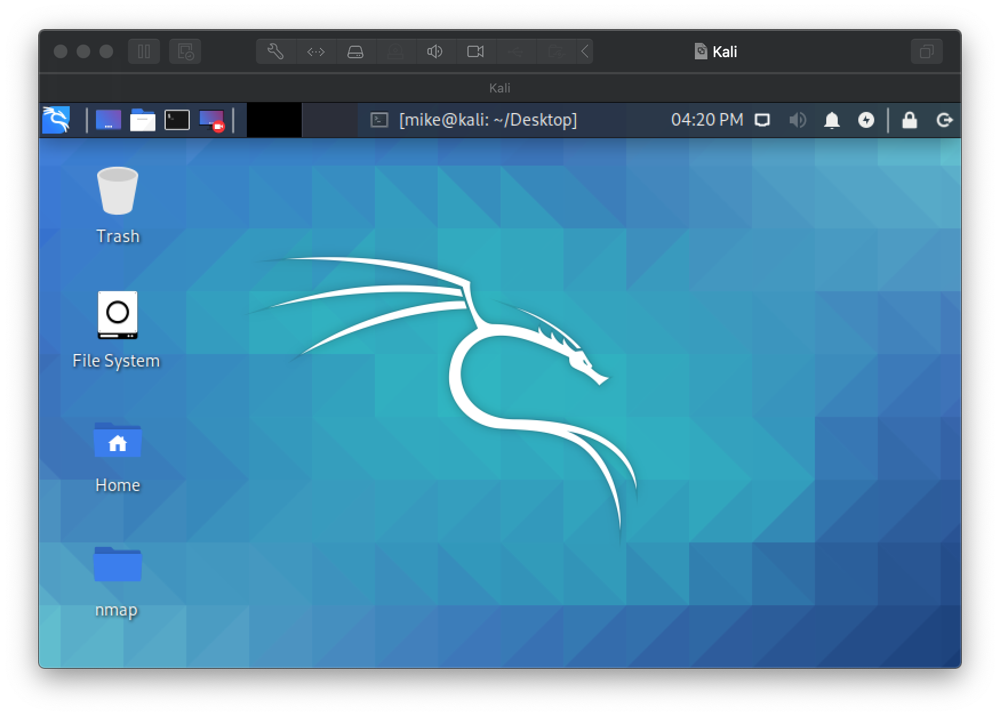

# Lab 01: Virtual Machine Setup and Kali Install

Before attempting this lab, please make sure you have completed all of the material in the lessons tab.

The table of contents for this lab is found below.

Part 1. Workstation Setup <br>
Part 2. Submission <br>

Create a copy of this google document [lastname_lab01](https://docs.google.com/document/d/1tFKmz9hf0MvN5OesWVDudbO5EwgtEz30zUYiuPoru2s/edit?usp=sharing) (File > Make a Copy) to record all of your assignment answers in.

> :warning: Failure to use answer document properly will result in a 10pt deduction from final score.

This week, we learned a bit about the hardware and software used by our laptops and other mobile devices. In this lab, we'll be setting up one of the workstations that we'll be using this semester. To do this, we'll be creating a *virtual machine (VM)*. We will be discussing virtualization in much greater depth later this semester, so if you don't fully understand what you are doing when you follow the instructions, don't worry! By the end of the semester you'll be familiar with the terminology and process used to get a VM up and running!

## Part 1: Workstation Setup 

### Installing VMWare

**Step 1.1.** Log into Brightspace and navigate to `Lab#01` (Assignments > Lab#01). There you should see the link `VMware Store` under the assignment instructions section. Click on that link to navigate to the VMware store. It's here you'll be able to download VMware workstation (windows) or VMware Fusion (macOS).

**Step 1.2.** At this point you should have successfully logged into the VMware store, downloaded the VMware version that relates to your operating system (OS), and installed VMware on your host machine.

 :interrobang: Question 1 - Provide a screenshot of VMware running.

#### Installing Kali

Use the below link to navigate to the Kali image downloader and download the *Kali Linux 64-Bit (Installer)* .iso file (usually this is the first download option).

* [The Kali Linux (64 bit), Penetration Testing Distribution](https://www.kali.org/downloads/) - [file](https://drive.google.com/file/d/1QVz9VUvuDyLbiYnGz_dh2g7MfcIpWKXI/view?usp=sharing)

Now, lets set up our Kali machine. We'll be doing a fresh install of an operating system ~ like you might do with a windows, macOS, or linux .iso file.

**Step 1.1** Follow the below instructions to create a new VM and install Kali on it.

Windows 10 - [VMWare Workstation](https://www.nakivo.com/blog/install-kali-linux-vmware/) - [PDF](files/file1.pdf) <br>
macOS - [VMWare Fusion](https://geekflare.com/kali-linux-installation-guide-vmware/) - [PDF](files/file2.pdf)

Use the below specifications and options to create your VM:

* Primary Memory (RAM): 4608 MB minimum (you may allocate more RAM if your system can handle it). It is recommended that you use no more than 50% of your system's RAM. We will be running several virtual machine's at one time and you may need to optimize your virtual machines memory usage.)
* Secondary Memory (Disk Capacity): 40 GB
* CPU Cores: 2
* User name: csf202
* Password: pa55word


**Step 1.2** Once installed and logged in, you should be greeted with the Kali desktop. <br>



> As always, you should take a snapshot of your fresh install in the event that your VM becomes corrupted along the way.

**Step 1.3** Open a terminal on your Kali machine and run the below command:

```text
csf202-student@kali:~$ whoami
```

 :interrobang: Question 2: Include a screenshot of your fresh Kali install.<br>
 :interrobang: Question 3: Make a **snapshot** of your fresh Kali install and include a screenshot of your snapshot.<br>

 > :bulb: [How to take a snapshot of a VM on VMWare Workstation 15](https://www.vmware.com/support/ws55/doc/ws_preserve_sshot_taking.html) - [PDF](files/file3.pdf)

 :interrobang: Question 4: What is a snapshot and how does it benefit you? <br>

## Part 2. Submission

Convert your answer document into a **.PDF** and upload a single `lastname_lab1.pdf` answer document containing all of your answers to the assignment questions to Brightspace through the attachment uploads option.
