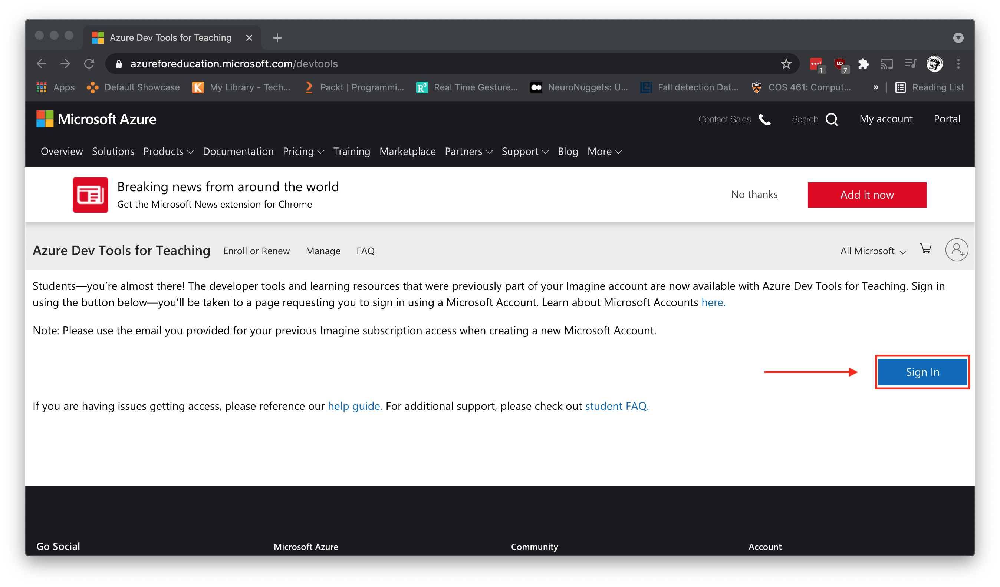
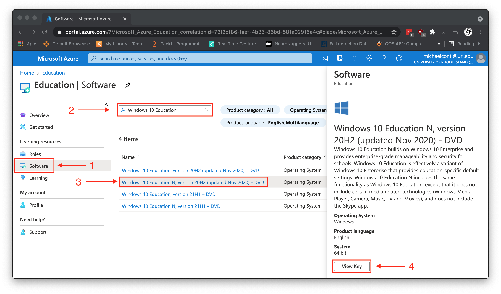

# Lab 02: Networking Details in VMWare and Windows 10

Before attempting this lab, please make sure you have completed all of the material in the lessons tab.

The table of contents for this lab is found below.

Part 1. Downloading and Installing Windows 10 <br>
Part 2. Windows 10 Networking Details <br>
Part 3. VMWare Networking Details <br>
Part 4. Submission <br>

Create a copy of this google document [lastname_lab02](https://docs.google.com/document/d/16wA-8N12TCTdHwOhogU0ScGHha_C7z6GZSbzY5fJYVg/edit?usp=sharing) (File > Make a Copy) to record all of your assignment answers in.

> :warning: Failure to use answer document properly will result in a 10pt deduction from final score.

This week, we learned a lot of important information and definitions relating to networks and network infrastructure devices. In this lab, we're going to take a closer look at some of the concepts we discussed in this week's lecture within a Windows 10 environment.

## Part 1: Downloading and Installing Windows 10

Like last week, we'll be creating another virtual machine. This time, we'll be loading a copy of Windows 10 as our operating system. <br>

**Step 1.1.** Log into [Microsoft Azure Portal](https://azureforeducation.microsoft.com/devtools). You'll need to use your URI SSO credentials here.<br>



**Step 1.2.** Once logged in, select `Software` in the navbar on the left.<br>

**Step 1.3.** In the search bar, type in `Windows 10 Education` and select `Windows 10 Education N, Version 20H2` <br>

**Step 1.4.** Scroll down in the info-pane on the right hand side and select the `View Key` button.<br>



**Step 1.5.** Take a screenshot of that product key and make sure you don't lose it, you'll be needing it later.<br>

**Step 1.6.** Select the `Generate URL` button, copy the URL.<br>

**Step 1.7.** Open a new tab in your browser and paste the copied link. A windows10.iso file should begin to download. <br>

**Step 1.8.** Use the windows10.iso to create a new virtual machine in VMWare using the below specifications for your machine. <br>

* Primary Memory (RAM): 2000 MB minimum (you may allocate more RAM if your system can handle it). 
* Secondary Memory (Disk Capacity): 40 GB
* CPU Cores: 2
* User name: csf202
* Password: pa55word

> If you don't remember how to create a VM using an .iso file, please refer to lab#01. <br>

 :interrobang: Question 1 - Provide a screenshot of the Windows 10 login screen.<br>

 **Step 1.9.** Create a snapshot of your Windows 10 VM.<br>

 ## Part 2. Windows 10 Networking Details

Now that you have successfully installed Windows 10 let's take a look at some of this VMs network properties.<br>

**Step 2.1.** Open the command prompt within the Windows 10 VM and run the command `ipconfig/all` <br>

> You can do this by searching for `cmd` in the bottom search bar or by using any of [these](https://www.howtogeek.com/235101/10-ways-to-open-the-command-prompt-in-windows-10/) - [file](./files/file1.pdf) methods.<br>

:interrobang: Question 2 - What is the IP Address of your Windows 10 VM?<br>

:interrobang: Question 3 - What is the Subnet Mask of your Windows 10 VM network?<br>

:interrobang: Question 4 - Provide a screenshot of your DNS server. <br>

:interrobang: Question 5 - What is DNS and what is it used for?<br>

:interrobang: Question 6 - What is the Default Gateway of your Windows 10 VM network?<br>

:interrobang: Question 7 - What is the MAC Address of your Windows 10 VM?<br>

**Step 2.2.** "Save the state" or "Power down" your Windows 10 VM.

## Part 3. VMWare Networking Details

Because you'll be using VMWare (or some other type-2 hypervisor like VirtualBox) in this and future classes, it will be helpful to become familiar with the VMWare settings.

**Step 3.1.** Spend some time exploring the VMWare settings. This will look different depending if you are using VMWare Fusion Pro(for macOS) or VMWare Workstation Pro (for Windows). Do your best to move through the different setting windows and understand what each section is saying. If you're not sure you can always look it up!

There are some nice videos about the VMWare networking settings for your VMs below:

[VMWare Workstation (15/16) Pro](https://kb.vmware.com/s/article/1018697) <br>
[VMWare Fusion Pro](https://graspingtech.com/vmware-fusion-add-network-adapter/)

> For VMWare Fusion users ~ no need to read the ***How to assign a static IP to Ubuntu*** section.

:interrobang: Question 8 - What is a NAT Network Adapter in VMWare (use external resources if needed). <br>

:interrobang: Question 9 - What benefits can we recognize by using a NAT Network Adapter?<br>

:interrobang: Question 10 - What is a Bridged Network Adapter in VMWare (use external resources if needed). <br>

:interrobang: Question 11 - What benefits can we recognize by using a Bridged Network Adapter? <br>

:interrobang: Question 12 - What is a Internal Network Adapter in VMWare (use external resources if needed). <br>

:interrobang: Question 13 - What benefits can we recognize by using a Internal Network Adapter? <br>

:interrobang: Question 14 - What is the IP address of your host machine?

> :bulb: Hint: We already know how to find an IP address on a Windows machine, so if your host machine is windows you can simply refer to some of the earlier steps in the lab. If your host is running macOS, you can use [this resource](https://www.wikihow.com/Find-Your-IP-Address-on-a-Mac) here to find your host IP.

Now that you have a basic understanding of how network adapters work in VMWare ~

**Step 3.2.** Assign a network adapter to your Windows 10 VM that will allow your Windows 10 VM to communicate with your host machine.

**Step 3.3.** Run the below command in your virtual machine's terminal:

```txt
c:\Users\csf202-student> ping <host-machine-IP>
```

> where `<host-machine-IP>` is replaced with the actual IP address of your host machine (e.g: `ping 192.168.12.1`)

:interrobang: Question 15 - Provide a screenshot of your Windows 10 VM pinging your host machine.

:interrobang: Question 16 - What is the IP Address of your Windows 10 VM once you changed the network adapter in VirtualBox. Provide a screenshot of your Windows 10 new IP Address.

:interrobang: Question 17 -  What network adapter did you assign to your Windows 10 VM that allowed your virtual machine to communicate with your host machine?


## Part 3. Submission

Convert your answer document into a **.PDF** and upload a single `lastname_lab2.pdf` answer document containing all of your answers to the assignment questions to Brightspace through the attachment uploads option.
