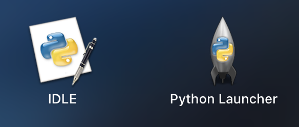
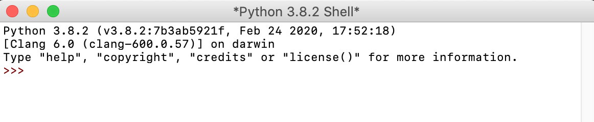
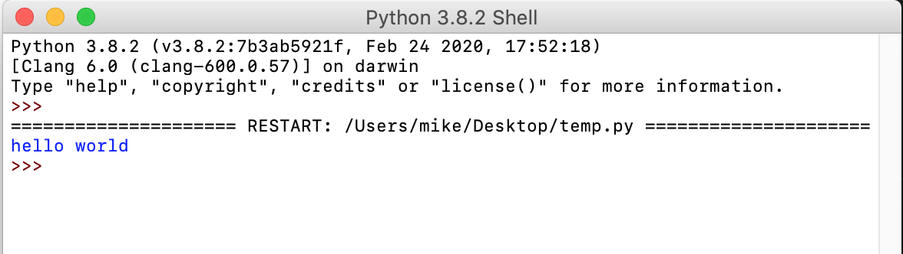
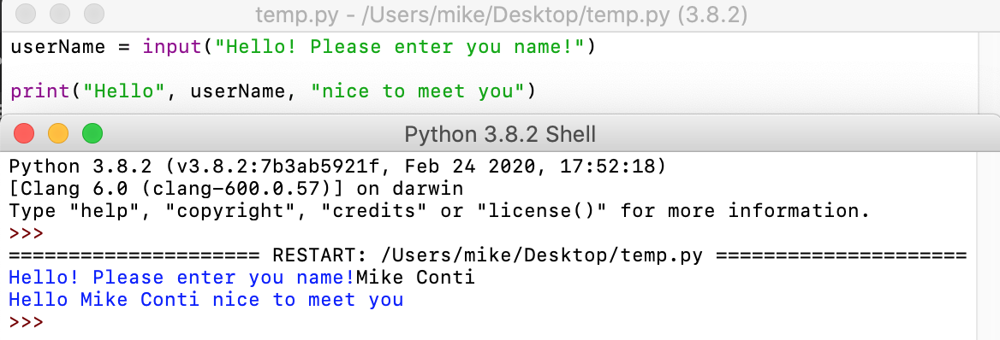

# Lab 03: Introduction to Python

Before attempting this lab, please make sure you have completed all of the material in the lessons tab.

The table of contents for this lab is found below.

&nbsp;&nbsp;&nbsp;&nbsp;&nbsp;&nbsp; Part 1. Installing Python <br>
&nbsp;&nbsp;&nbsp;&nbsp;&nbsp;&nbsp; Part 2. Print Statements <br>
&nbsp;&nbsp;&nbsp;&nbsp;&nbsp;&nbsp; Part 3. Variables and Input  <br>
&nbsp;&nbsp;&nbsp;&nbsp;&nbsp;&nbsp; Part 4. Data Types and Arithmetic Expressions <br>
&nbsp;&nbsp;&nbsp;&nbsp;&nbsp;&nbsp; Part 5. Submission <br>

Create a copy of this google document [lastname_lab03](https://docs.google.com/document/d/1rfK-Lb4ocslLxieoG_ra0nudwiFvtTd4SS-kBjvS1xU/edit?usp=sharing) (File > Make a Copy) to record all of your assignment answers in.

> :warning: Failure to use answer document properly will result in a 10pt deduction from final score.

Python is a programming language. Like other languages, it gives us a way to communicate ideas. In the case of a programming language, these ideas are *commands* that people use to communicate with a computer!

We convey our commands to the computer by writing them in a text file using a programming language. These files are called programs. Running a program means telling a computer to read the text file, translate it to the set of operations that it understands, and perform those actions.

## Part 1: Installing Python

**Step 1.1** [Download Python 3.x.x](https://www.Python.org/downloads/). 

**Step 1.2** Extract and install Python on your machine. If successful, you should see the below icons.



**Step 1.3** Launch the IDLE or *Integrated Development and Learning Environment* and you'll notice a terminal-like shell.



This is similar to a terminal that you can execute terminal commands against, but instead of shell commands it will accept Python statements. 

**Step 1.4** Create a new Python file by selecting `File > New File`. You can name it helloWorld.py

Now, we have an environment where we can write full Python scripts instead of single, one-line Python statements.

## Part 2: Print Statements

Let's start with some basics!

Python is a very friendly language if you've never written code before, so don't worry! Usually, the first program a programmer writes when learning a new language is the *hello world* program, where we simply execute a print statement out to our console. 

**Step 2.1** Type the below *hello world* program in your new file.

```Python
print ("Hello World")
```
**Step 2.2** Save your file with `File > save` or cmd + s or ctrl + s

**Step 2.3** Run your code by selecting `run > run module` (or using the hotkey F5 (fn + F5 on Mac)). The mapping of this command might be different on a Windows machine, but it should be very similar.

If successful, you should see the results of your print out statement as shown below. 



Modify your print statement to say the below statement.

```Python
print ("Hello World, my name is <your name> and I love Python!")
```

:interrobang: Question 1. Include a screenshot of your results in your answer document.

## Part 3: Variables and Input 

Ok, now you know how to write statements out to the console. But, how do we accept user input and store that input into a variable?

**Step 3.1** Write the below code to accept user input, store that input into a variable, and use that variable in a print out statement.

```Python

userName = input ("Hello! Please enter you name!")

print ("Hello", userName, "nice to meet you")
```

> :bulb: **What did we just do?** The reserved keyword `input` is used when we want the user to provide some type of input to your program. Whatever the user types in gets stored in the `variable` username. Finally, we print out a welcome message using the name the user provided. Notice the words or `string` data type is always enclosed with double quotation marks? Also, we must `concatenate` the variable and strings with a comma when mixing strings and variables together.

**Step 3.2** Run your code. Your Python IDLE will pop up, waiting for you to supply your program with input. 

**Step 3.3** Type your name into the IDLE prompt and hit enter.

:interrobang: Question 2. Provide a screenshot of the result of your input statement. I've included an example below, but instead of Mike Conti, it should be your full name.



 ## Part 4: Data Types and Arithmetic Expressions

Oftentimes, we want to perform some type of computation on numeric data. Just like in math, we have a set of data types and operators that we can use to perform these computations with. Don't forget, a `data type` or simply `type` is an attribute of data which tells the computer how the programmer intends to use the data. Most programming languages support common data types of *string, integer, double, and boolean*. 

Just like in math, when we write different arithmetic expressions in Python each operator has a precedence that governs when that operation takes place. You can learn more about which operators have what precedence [here](https://www.mathcs.emory.edu/~valerie/courses/fall10/155/resources/op_precedence.html).

Analyze the Python arithmetic expressions below and try to answer questions 3 - 9 without running this code:

> We call this *tracing code*. At first, it's very helpful to use a piece of paper and pen to keep track of your variables (in this case, `a, b, c`).

```Python
a = 21
b = 10
c = 0

c = a + b
print "Line 1 - Value of c is ", c #Checkpoint#01

c = a - b
print "Line 2 - Value of c is ", c #Checkpoint#02

c = a * b
print "Line 3 - Value of c is ", c #Checkpoint#03

c = a / b
print "Line 4 - Value of c is ", c #Checkpoint#04

c = a % b #Hint: The % is the "modulus" operator ~ which returns the remainder of the expression (e.g (7 % 3 == 1)).
print "Line 5 - Value of c is ", c #Checkpoint#05

a = 2
b = 3
c = a**b #Hint: The ** is the "exponentiation" operator ~ which returns a^b (e.g 2**3 == 8).
print "Line 6 - Value of c is ", c #Checkpoint#06

a = 10
b = 5
c = a//b #Hint: The // is the "floor division" operator ~ which drops the remainder part of the quotient (e.g 12//5 == 2). 
print "Line 7 - Value of c is ", c #Checkpoint#07

```

:interrobang: Question 3. What is the value of C at *Checkpoint#01*? <br>

:interrobang: Question 4. What is the value of C at *Checkpoint#02*? <br>

:interrobang: Question 5. What is the value of C at *Checkpoint#03*? <br>

:interrobang: Question 6. What is the value of C at *Checkpoint#04*? <br>

:interrobang: Question 7. What is the value of C at *Checkpoint#05*? <br>

:interrobang: Question 8. What is the value of C at *Checkpoint#06*? <br>

:interrobang: Question 9. What is the value of C at *Checkpoint#07*? <br>

**Step 4.1** Run the above block of code. If any of your checkpoint answers for questions 3 - 9 were incorrect, please replace it with the correct answer.

> Retrace your code and see if you can get the same answer as the output when you ran the code. Understand where you went wrong!

:interrobang: Question 10. Write a program that stores your `name`, `major`, and `student-id` in variables. Use those in a printout statement. (e.g: Hello! My name is Michael and I am a Computer Science Major. My URI student-id is 123456) <br>

## Part 5. Submission

Convert your answer document into a **.PDF** and upload a single `lastname_lab3.pdf` answer document containing all of your answers to the assignment questions to Brightspace through the attachment uploads option.
