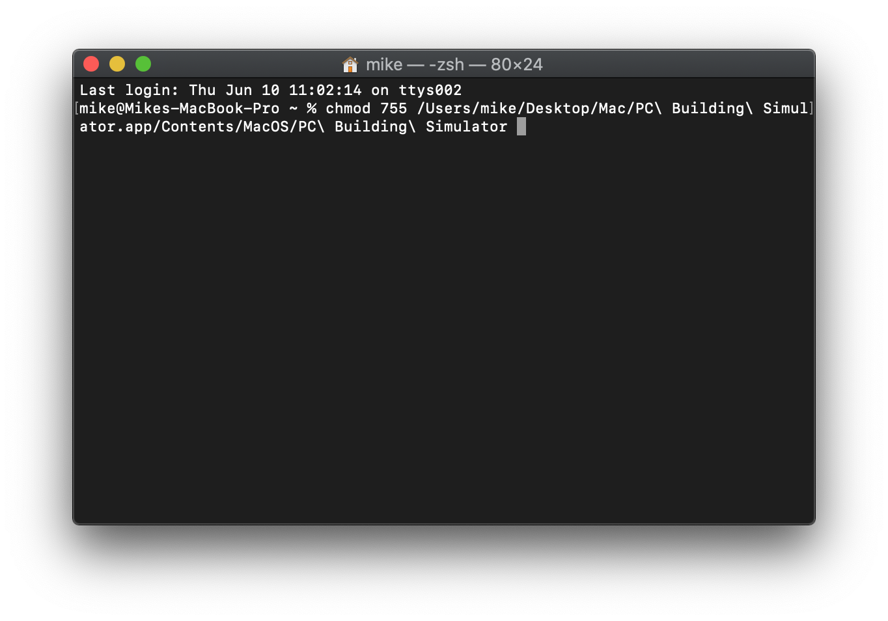
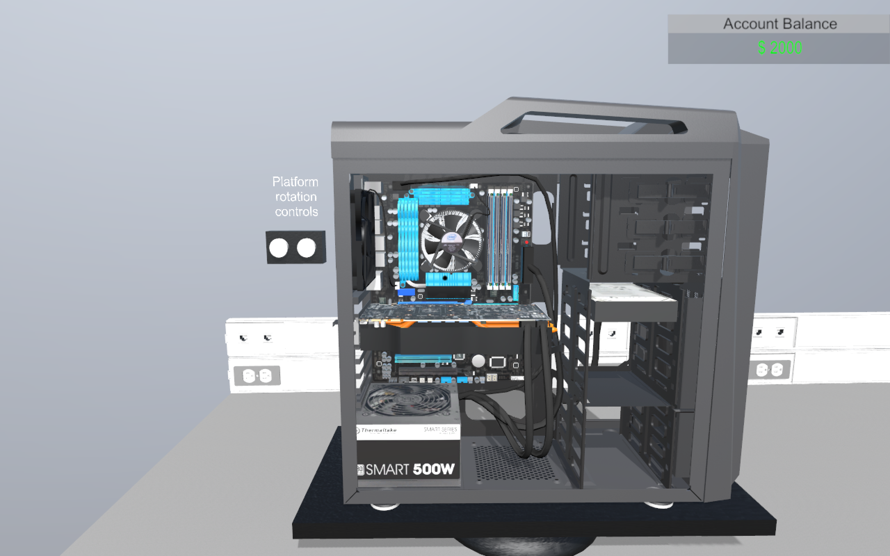

# Lab 04: PC Building Simulator

Before attempting this lab, please make sure you have completed all of the material in the lessons tab.

The table of contents for this lab is found below.

&nbsp;&nbsp;&nbsp;&nbsp;&nbsp;&nbsp; Part 1. Simulator Setup  
&nbsp;&nbsp;&nbsp;&nbsp;&nbsp;&nbsp; Part 2. Building a PC  
&nbsp;&nbsp;&nbsp;&nbsp;&nbsp;&nbsp; Part 3. Submission  

Create a copy of this google document [lastname_lab04](https://docs.google.com/document/d/194RPvYugQ5Itzx59fp7ydeZ0XqhSrt1ntzeanENxKTk/edit?usp=sharing) (File > Make a Copy) to record all of your assignment answers in.

> :warning: Failure to use answer document properly will result in a 10pt deduction from final score.

So far this semester we've spent *a lot* of time familiarizing ourselves with the fundamental components of a computer and their specific functions. In this lab, we'll synthesize all of that working knowledge that we've been building into an important and practical skill set ~ building a computer.

Because we don't have a physical lab in CSF 202, we need to virtualize the experience of building a computer. I've built quite a bit of physical computers and I believe this simulation does a really nice job emulating "the real deal". 

## Part 1: Simulator Setup

First, let's setup our simulator.

**Step 1.1** Download the below appropriate application based on your host computer's OS.

[Windows 10: PC Builder Simulator](https://drive.google.com/u/0/uc?id=13IPe1QRiacYuHYtor2o4QCP2RZ22DIFv&export=download)  
[MacOS: PC Builder Simulator](https://drive.google.com/u/0/uc?id=1JtTCYSHOYUr578G8xlRYNcRMDSfXCwtz&export=download) 

**Step 1.2** Follow the below install instructions depending on your host OS.

=================

**MacOS**

**Step 1.2.1** Once you've downloaded your `Mac.zip` file, decompress the file by double clicking on it.

**Step 1.2.2** Right click the app and select Show Package Contents.

**Step 1.2.3** Navigate down the directory path `Contents > MacOS`. You should see a file titled "PC Building Simulator".

**Step 1.2.4** Open a terminal (search for "terminal" in spotlight (cmd + space) or user Finder to navigate to Applications > Utilities > Terminal).

**Step 1.2.5** Type `chmod 755` into your terminal.

**Step 1.2.6** Drag the "PC Building Simulator" file discussed in *Step 1.2.3* into your terminal window.

> Depending on your computers personal directory, you should see something like the below image:

**Step 1.2.7** Hit enter in your terminal to run the command.

> What did this do? chmod 755 sets the 755 permission for a file. 755 means full permissions for the owner and read and execute permission for others.

**Step 1.2.8** Launch the PC Simulator app from the Mac folder.

> MacOS will usually block applications that are not downloaded from the App Store, so you might need to give permission to run this app on your machine by going to System Preferences > Security and Privacy > Allow Apps and identified developers. (You'll likely need to click the lock on the bottom left hand corner of this window, unlock it, and allow the application to run). If you're having issues allowing the app to run, you can find more help [here](https://it.nmu.edu/docs/allowing-third-party-applications-install-macbook). 

**Windows 10**

**Step 1.2.1** Once you've downloaded your `x64.zip` file, extract the file (Right-click > Extract All).

**Step 1.2.2** Open the x64 folder and run the application.

=================

## Part 2. Building a PC

**Step 2.1** Once the application is running, select `Ultra or Fantastic` for graphics quality. You can increase the screen resolution for your display if you know which will work best for you.

**Step 2.2** Select `Play`.

:interrobang: Question 1. Submit a screenshot of the menu screen for the PC Building Simulator.

**Step 2.3** Select `Tutorial`.

At this point, you'll be presented with a text prompt like the one below:

*Be sure to read all of these prompts very carefully*. At this point, the simulator provides guided steps to build your first machine.

**Step 2.4** As the prompt instructs, press `i` to access your component inventory. Review the components you have and press `i` again to continue with the tutorial.

**Step 2.5** Move through the tutorial instructions and ***take screenshots after you've successfully installed each component on your machine***. 

You can find a summary of the simulator controls below:

### Simulator controls:

`w` - Move forward  
`a` - Move left 
`s` - Move backward 
`d` - Move right 

`t` - Toggle (bring up or bring down most recent text-box prompt) 
`q` - Quit the simulator 

`esc` - Bring up menu options 

`f1 or (fn + f1) on Mac` - Set interface mode (mount component mode/ unmount component mode/ cabling mode) 

`left-click (mouse)` - Interact with an object

:interrobang: Question 2. Provide a screenshot of the motherboard standoffs successfully installed on your machine.

:interrobang: Question 3. Provide a screenshot of the power supply successfully installed on your machine.

:interrobang: Question 4. Provide a screenshot of the I/O shield successfully installed on your machine.

:interrobang: Question 5. Provide a screenshot of the motherboard successfully installed on your machine.

:interrobang: Question 6. Provide a screenshot of the CPU successfully installed on your machine.

:interrobang: Question 7. Provide a screenshot of the CPU thermal paste successfully installed on your machine.

:interrobang: Question 8. Provide a screenshot of the heat sink (CPU cooler) successfully installed on your machine.

:interrobang: Question 9. Provide a screenshot of the GPU successfully installed on your machine.

:interrobang: Question 10. Provide a screenshot of the four (4x) RAM modules successfully installed on your machine.

:interrobang: Question 11. Provide a screenshot of the HDD modules successfully installed on your machine.

:interrobang: Question 12. Provide a screenshot of the fan successfully installed on your machine.

At this point, all of the computer components have been successfully installed. Now it's time to install the computer cabling so these devices have power and data lines.

**Step 2.6** Enter cabling mode (F1) and wire this PC. If the connector you select is correct, you will be presented with information about that connector type.  ***Take screenshots of each info-pane that describes that connector***. 

> :bulb: Tip: you can rotate the computer using the buttons on the wall to the left of the machine. This can be helpful with connecting the SATA power and data lines for your HDD.

:interrobang: Question 13. Provide a screenshot of the EPS12V power cable info-pane once successfully installed on your machine.

:interrobang: Question 14. Provide a screenshot of the 20/24 ATX power cable info-pane once successfully installed on your machine.

:interrobang: Question 15. Provide a screenshot of the PCI-E power cable (8 pin or 6 pin) info-pane once successfully installed on your machine.

:interrobang: Question 16. Provide a screenshot of the SATA power cable info-pane once successfully installed on your machine.

:interrobang: Question 17. Provide a screenshot of the SATA data cable info-pane once successfully installed on your machine.

:interrobang: Question 18. Provide a screenshot of the "Congratulations, you have finished assembling your computer" message.

And that's all it takes to build a computer! Not do bad, right? Your final product should look like the machine below:

## Part 3. Submission

Convert your answer document into a **.PDF** and upload a single `lastname_lab4.pdf` answer document containing all of your answers to the assignment questions to Brightspace through the attachment uploads option.
