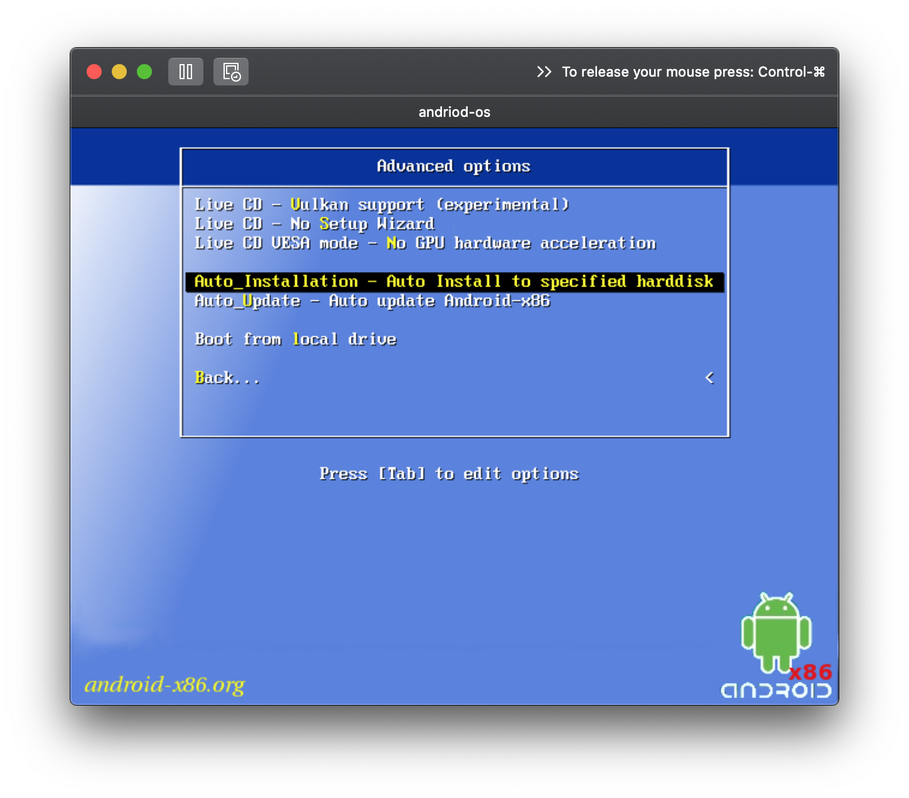
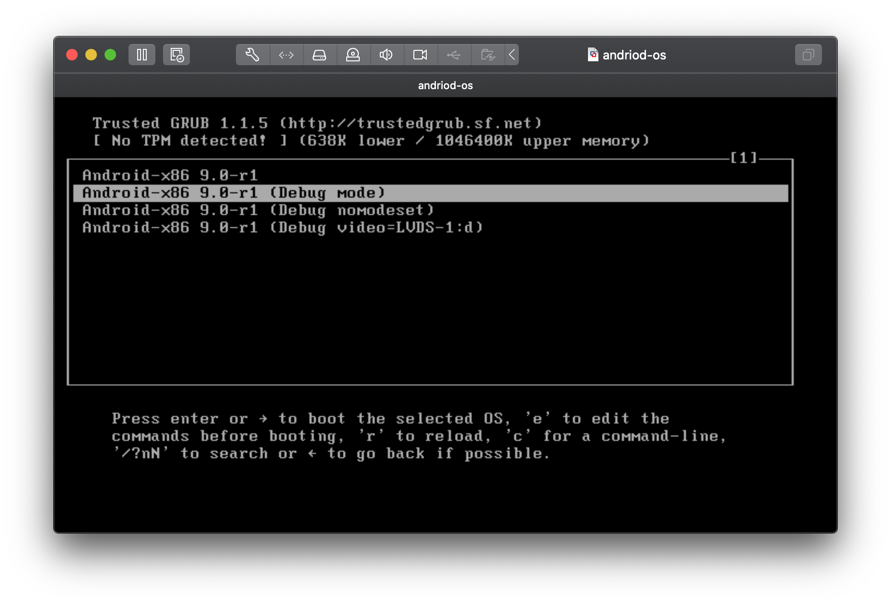
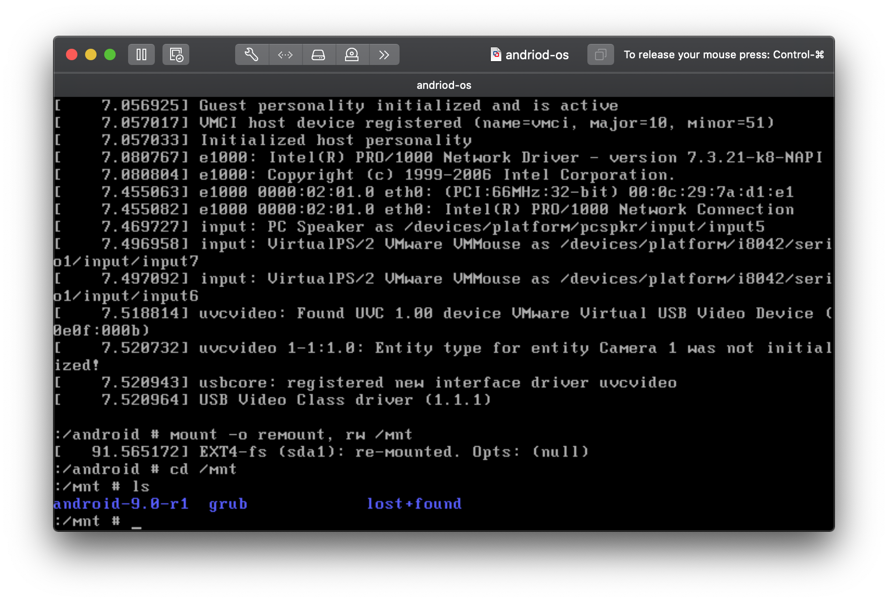
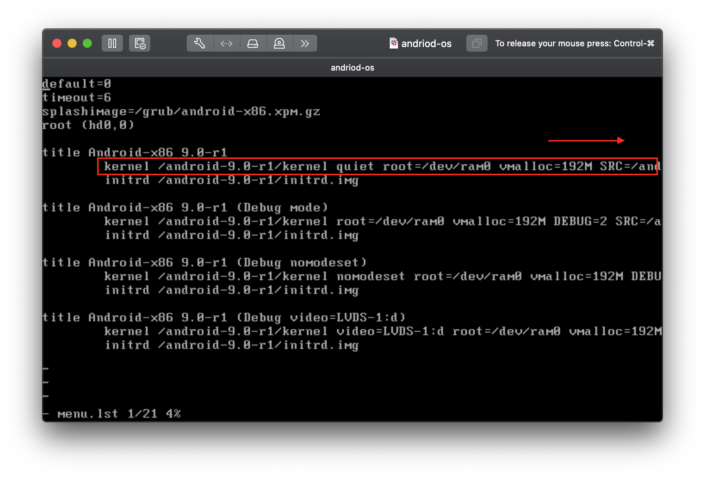
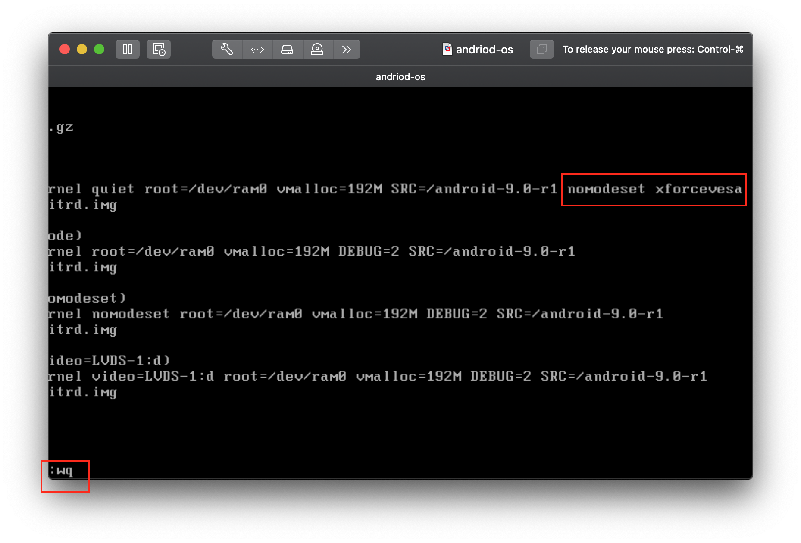
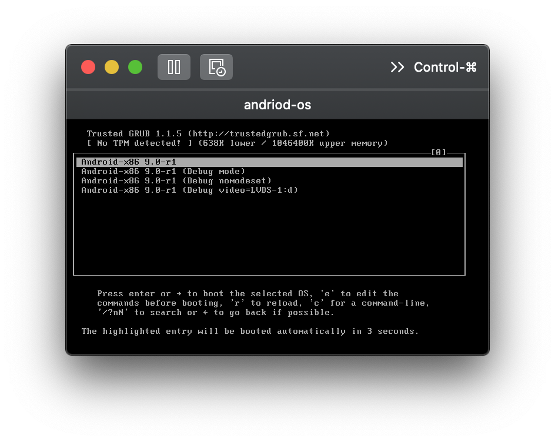
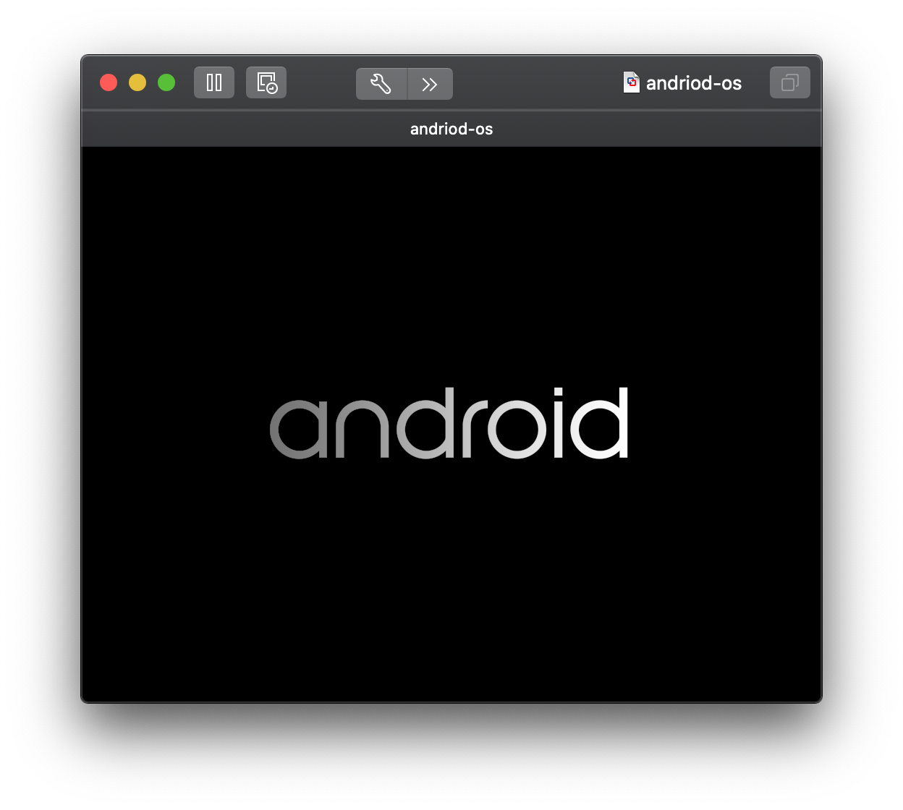
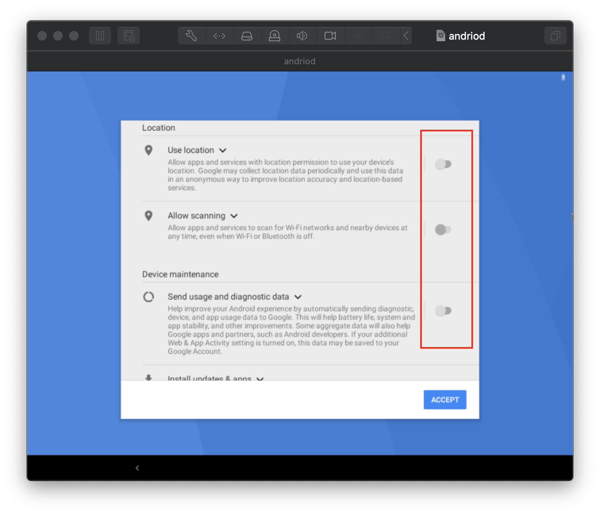
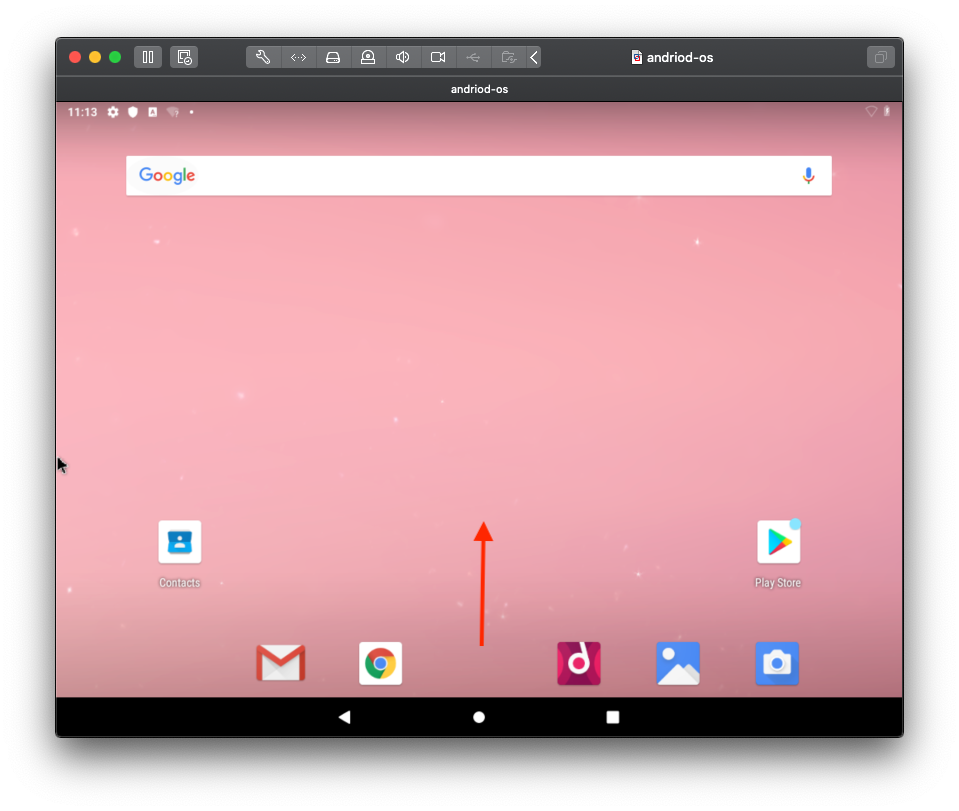
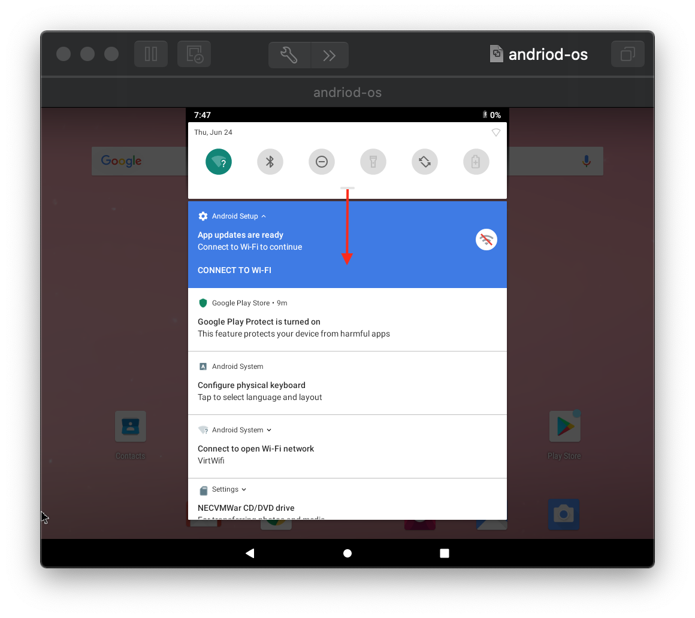

# Lab 06: Mobile Device Management & Security

Before attempting this lab, please make sure you have completed all of the material in the lessons tab.

The table of contents for this lab is found below.

&nbsp;&nbsp;&nbsp;&nbsp;&nbsp;&nbsp; Part 1. Android VM Setup & Install <br>
&nbsp;&nbsp;&nbsp;&nbsp;&nbsp;&nbsp; Part 2. Getting Familiar with Android <br>
&nbsp;&nbsp;&nbsp;&nbsp;&nbsp;&nbsp; Part 3. Keeping Track with Prey <br>
&nbsp;&nbsp;&nbsp;&nbsp;&nbsp;&nbsp; Part 4. Submission <br>

Create a copy of this google document [lastname_lab06](https://docs.google.com/document/d/1qDvJwa0hvI85IF82GRPYPZ5iKlKAGNOSFm8ajLOeX0I/edit?usp=sharing) (File > Make a Copy) to record all of your assignment answers in.

In this lab, we'll be working with the Android mobile operating system. Setting up this workstation will be a bit more difficult than when we installed Windows and Kali because we'll need to modify some configuration files from our terminal for it to work properly. It's common to tweak and inspect configuration files for different software and applications for it to work properly in different environments, so this lab will help develop this important skill.

Once installed, We'll be looking at some of the security features Android has to offer.

## Part 1 - Android VM Setup

**Step 1.1** Download the Android ISO file [here](https://drive.google.com/uc?id=1N3cKoGnsPr0dvMakKPjj7xAxSEl6gvRq&export=download) <br>

**Step 1.2** Create a new VM in VMWare named `android-os` using the Android ISO downloaded in Step 1.1 <br>

**Step 1.3** Configure the settings of this using the below specifications: <br>

* Processors: 2
* Primary Memory: ~ 1500mb - 2500mb
    * In Processors and Memory Settings (Advanced)
        * Enable hypervisor applications in this virtual machine
        * Enable code profiling applications in this virtual machine
        * Enable IOMMU in this virtual machine
* Secondary Memory (Default Value ~ 20gb)
* In Display Settings:
    * Check: Accelerate 3D graphics


**Step 1.4** Launch your Android VM <br>

**Step 1.5** Key down to the advanced options item and select Auto_Installation <br>



**Step 1.5** Move through the installation prompts by confirming each prompt <br>

**Step 1.6** Select the `Reboot` option when finished <br>

**Step 1.7** At this point, Android will attempt to load, but it's likely you'll be presented with a hanging console prompt and then a black screen. <br>

> If Android *does* begin to load, you can skip the below configuration steps. <br>

**Step 1.8** Shutdown (this is different from suspend) your VM. <br>

**Step 1.9** Power on your VM and select `Debug mode` <br>



**Step 1.10** Wait for the debug mode to stop loading. You'll get an `Android:/Android #` terminal prompt when it's done.

**Step 1.11** Type in the below command:

```cmd
Android:/Android # mount -o remount,rw /mnt
```

**Step 1.12** cd into the `/mnt` directory



**Step 1.13** cd into the `grub` directory and list all of the files / directories at this current directory.

Now, we are going to edit the menu.lst grub loader file with the terminal text editor tool `vi`.

**Step 1.14** Open the menu.lst file with the below terminal command:

```cmd
Android:/Android # vi menu.lst
```

**Step 1.15** Use your arrow keys to find the line indicated below and move to the very end of the line <br>



**Step 1.16** Modify this line by pressing `a` then `space` and add the words `nomodeset xforcevesa` <br>

Now, we need to exit "edit" mode in `vi`. Right now, anything we type will edit the `menu.lst` file. 

**Step 1.17** Exit edit mode in vi with `shift + :`<br>

In the bottom of the left hand corner, you should see a `:` prompt. This means you are no longer editing the file.

**Step 1.18** Type in `wq` and hit `enter`<br>



Now, you should be back in the normal terminal environment.

**Step 1.19** Run the below command to reboot your VM

```cmd
Android:/Android # reboot -f
```
**Step 1.20** Select the normal boot option. Android should begin to boot.

> You might see the console prompt and black screen for a moment or two. Give it a minute to load.


| | |
| --- | ----------- |
|  |  |

## Part 2. Getting Familiar with Android

**Step 2.1** Move through the Android install prompts

* Start
* Wifi: Skip
* Date * Time: Next
* **Deselect** location, scanning, and sending usage and diagnostic data
* Protect your tablet: Not now
* Select a home app: Quickstep

 

:interrobang: Question 1: Submit a screenshot of your Android device VM homescreen <br>

**Step 2.3** Take a snapshot of your Android VM

**Step 2.4** Open the app menu by "swiping up" (click and drag up) from the bottom of the screen to the top with your mouse.

 

> Remember, our Android VM thinks it's a phone/tablet with touch services. So some menus will be "hidden" and can only be opened with swipes (a very common navigation technique on mobile devices)

**Step 2.5** Select the `Settings` application <br>

**Step 2.6** Select the `Security & Locations` application <br>

:interrobang: Question 2: Describe what the below security features do in detail. Feel free to use external resources to help with your descriptions. <br>

* Find My Device
* Screen lock
* Location
* Encryption & Credentials

:interrobang: Question 3: What was the date of this devices last security update? <br>

:interrobang: Question 4: How many user accounts are on this device? What is the user name? <br>

:interrobang: Question 5: What version of Android is this VM running? <br>

**Step 2.7** Access your quick access menu center and notifications by tapping the top center of the window, or swiping down from the top center  <br>

**Step 2.8** Expand this menu more by dragging down the bottom center of the quick access menu center window  <br>

 

:interrobang: Question 6: Describe the eight features / settings buttons you can change from ths view <br>

:interrobang: Question 7: Submit a screenshot of the Android quick access menu center <br>


## Part 3. Keeping Track with Prey

Knowing where your assets are at any given time is crucial for the security of your devices and the integrity, availability, and confidentiality of the data on it. Most devices these days have native tracking options like the "Find My" network for airtag and Apple devices and the "Find My Device" for Android devices. Third party software like Prey can help avoid information loss within your remote workforce by using persistent device tracking & security features like remote wipe.

**Step 3.1** Using your Windows 10 VM ~ download and install the free version of [The PreyProject Software](https://preyproject.com/download/) <br>

Once the application is installed, your browser should open up automatically to a [configuration page](https://panel.preyproject.com/auth/configuration/setup?lang=en).

**Step 3.2** Select `New User` and create a Prey account with your uri.edu email <br>

> Keep your Windows 10 VM on and open. We'll be moving to your host computer for the next few steps but we still need your Windows 10 machine

**Step 3.3** **On your host machine**, verify your confirmation email and log into your Prey account

:interrobang: Question 8: Submit a screenshot of your Prey dashboard.

**Step 3.4** Select the devices tab. 

:interrobang: Question 9: How many devices can you register with Prey's free version?

**Step 3.5** Select your Windows 10 device

**Step 3.7** Select the "Send message" action in the actions menu on the right side of the Prey dashboard

**Step 3.8** Keep the default message provided by Prey and hit confirm.

:interrobang: Question 10: Submit a screenshot of the Prey alert that was just sent to your Windows 10 VM

:interrobang: Question 11: What other remote security actions can you perform on the device that you installed Prey on?

**Step 3.9** Select the `Control Zones` tab. 

:interrobang: Question 12: What does the `Control Zones` tab enable you to do?

:interrobang: Question 13: Assume you are a security administrator for a mid-sized organization that manages a fleet of 150 mobile phones and 400 laptops. Describe what Prey is and justify how it would help you as a security administrator to your organization's finance department. What financial benefits can the company recognize with a tool like this? 


## Part 4. Submission

Convert your answer document into a **.PDF** and upload a single `lastname_lab6.pdf` answer document containing all of your answers to the assignment questions to Brightspace through the attachment uploads option.
