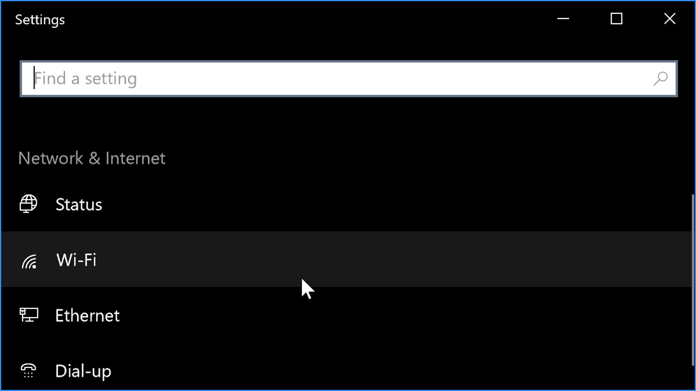
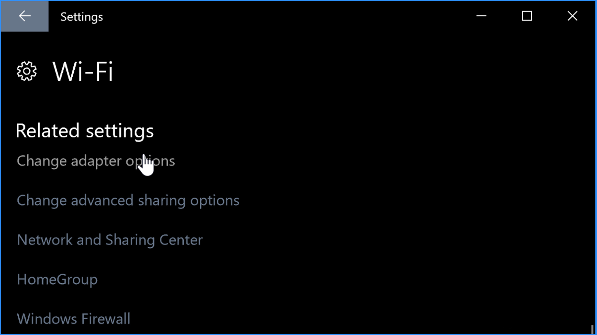

# Lab 07: Windows CMD and Powershell

Before attempting this lab, please make sure you have completed all of the material in the lessons tab.

The table of contents for this lab is found below.

&nbsp;&nbsp;&nbsp;&nbsp;&nbsp;&nbsp; Part 1: ping and arp <br>
&nbsp;&nbsp;&nbsp;&nbsp;&nbsp;&nbsp; Part 2: ipconfig, netstat, and tracert<br>
&nbsp;&nbsp;&nbsp;&nbsp;&nbsp;&nbsp; Part 3: Submission <br>

Create a copy of this google document [lastname_lab07](https://docs.google.com/document/d/1vugvmfVL2MCUJ6H9mxCEQkjuSMve246xEkIQ3_QWxQU/edit?usp=sharing) (File > Make a Copy) to record all of your assignment answers in.

In this lab, we'll get some more experance with the windows shell or CMD.

## Part 1: ping and ARP

### ping

**Step 1.1** Open your Windows 10 VM

**Step 1.2** Select the Windows icon in the bottom left corner of your desktop

**Step 1.3** Type the below command:

```txt
cmd.exe
```

 > :bulb: If you want to open an elevated command prompt, that is, you want to open a command prompt as an Administrator you can press `Ctrl + Shift + Enter`

Now that we've gained control of the Windows Command Prompt, let's have a little fun. 

`Ping` is a go-to tool used by network administrators and engineers when troubleshooting connectivity issues. Before we dive into it, let's take a look at the help system.

You can access help for almost any built-in Windows command by adding a space and a forward slash "?" at the end. So If I want to see what options are available for ping I can type:

**Step 1.4** Type the below command:

```txt
C:\Windows\system32> ping /?
```

You should be presented with the following options and usage related ping.


Here, we can see that we can do bunch of important things like change the TTL values with the -i flag or ping using IPv6 with the -6 flag.  

But today we'll take a closer look at the -n flag.

Normally ping sends four ICMP echo request messages to the target; however, with the -n flag we can change that to almost any number we like. Instead of typing `ping 8.8.8.8`

**Step 1.5** Type the below command:

```txt
C:\Windows\system32> ping -n 5 8.8.8.8
```

> The IP address 8.8.8.8 is a well known public DNS server hosted by Google

:interrobang: Question 1: Submit a screenshot of your successful ping request <br>

:interrobang: Question 2: What does the `-n 5` portion of this command do? <br>

### arp

Ok, lets move to the ARP command. A good way to remember what this command does is by thinking about the barking a dog makes ~ `Arp Arp Arp!`. When you hear the dog barking the middle of the night, everyone in each house on your street hears it and wakes up. This is exactly what ARP does.

When a host, meaning a computer, a server, a router, or any device connected to a network wants to send a message to another host it has to scream to everyone on it's street (network).  When we use the ARP command, that host machine it's asking for the layer 2 MAC Address (also known as a physical address or burned-in address) of the target machine so it can assemble a data frame and forward it on it's way.

Computers actually need more than IP addresses to communicate. IP Addresses provide end-to-end connectivity, for example, you to uri.edu.  MAC Addresses provide hop-to-hop connectivity, for example, your computer to your home router and then your home router to your ISP's router and so on. When you try to visit uri.edu, your machine resolves that domain name to its IP address: 64.131.77.69 then it creates an HTTP GET request to URI's webserver which serves the website files.

But how does the HTTP GET request know where to go?

That's the point of ARP and IP addresses.  I'll dig into this in a future post, but right now I just want you to know that ARP is a layer 2 function of the OSI model and IP is a layer 3 function and sometimes when troubleshooting issues you'll want to use the ARP command.

For example, if you are having problems connecting to a computer on the LAN it might be because you have two hosts on the LAN with the SAME IP address.  So some of your data frames are going to the wrong destination. 

**Step 1.6** Open the manual for ARP (like what we did with PING) <br>

:interrobang: Question 3: Submit a screenshot of the ARP manual

**Step 1.6** Use the option that shows all of the current ARP entries on your PC

:interrobang: Question 4: What command did you use?

:interrobang: Question 5: Submit a screenshot of this ARP command result

## Part 2: ipconfig, netstat, and tracert


### ipconfig

**Step 2.1** Select the Windows icon in the bottom left corner of your desktop

**Step 2.2** Type the below command:

```txt
powershell
```

> :bulb: **What's the difference between CMD and Powershell?** PowerShell is a more advanced version of the cmd used to run external programs like ping or copy and automate many different system administration tasks which are not accessible from cmd.exe. It's quite similar to cmd except it's more powerful and uses different commands altogether.

**Step 2.3** Type the below command:

```txt
PS C:\> ipconfig
```

:interrobang: Question 6: What is the IPv4 Address of this machine? <br>

:interrobang: Question 7: What is the Subnet Mask of this machine? <br>

:interrobang: Question 8: What is the Default Gateway of this machine?<br>

**Step 2.4** Right click the little network connection icon in the bottom right corner of the screen

**Step 2.5** Select "Open Network & Internet Settings". Here you can find your Wireless Adapter.




**Step 2.6** Select your current connection type (WiFi or Eithernet) and select "Change adapter options"



When you click that you'll see your Wireless Adapter show up in Windows.  Now all you need to do is right-click that, go to Status and choose the "Details" button to see your IP address and all that other stuff we saw with ipconfig.


If we want to see more information we can use the below command in our shell:

**Step 2.3** Type the below command:

```txt
PS C:\> ipconfig /all
```

Now we can see the hostname, the domain that the computer is joined to, as well as the network interface card name, MAC Address (that's the Physical Address shown below) and even the DNS Server. 


:interrobang: Question 9: Submit a screenshot of your `ipconfig /all` result

If we want to see all the DNS answers that have been cached on the client we can run

**Step 2.4** Type the below command

```txt
PS C:\> ipconfig /displaydns
```


To flush everything we can run:

**Step 2.5** Type the below command:

```txt
PS C:\> ipconfig /flushdns
```

Sometimes you'll want to do that if you're having problems browsing websites but other network aware applications work such as ping.  For example, if you can't visit uri.edu but you can ping 8.8.8.8 then you most likely have a DNS issue.  The name isn't being resolved to an IP address and that might be because the DNS cache contains an invalid entry.

### netstat

Netstat shows network statistics. If we just type netstat by itself we'll see all the connections to and from our localhost.

**Step 2.6** Type the below command:

```txt
PS C:\> netstat
```


Often, we'll need to filter netstat to only display the most important information.

By using the `-anob` flag we're telling netstat to:

* a: display all connections and ports
* n: don't display the hostnames, just show me IP addresses.
* o: display the process ID responsible for the connection
* b: display the binary name associated with the initiating process ID.  For example, chrome.exe.

We can further improve this command by combining it with findstr "ESTABLISHED" to only display "ESTABLISHED" connections.  These are the most interesting (and possibly worrisome).

**Step 2.6** Type the below command:

```txt
PS C:\> netstat -anob | findstr "ESTABLISHED"
```

> If you have no connections, open up your browser, go to uri.edu, and re-run the command. 

:interrobang: Question 10: Submit a screenshot of your `netstat -anob | findstr "ESTABLISHED"` command

You should see something simiar to the screenshot below:


The first column shows the protocol, TCP is being used.  

The next column shows the source IP and port.  `10.1.1.10` is my source IP and that `49844 port` number, in fact, all those 50,000 ish numbers after the IP are the ephemeral source ports.  These are numbers the operating system generated on demand so the connected resource knows how to send data back to my machine.

The next column shows the destination IP and port. I'm seeing a lot of stuff like this:

`8.253.68.14:80`

So this means I have an established connection to some sever at `8.253.68.14` over `port 80` (which is the default port for HTTP, so it's probably a web browser - but doesn't have to be - it could be malware using port 80 as a communication channel so don't make assumptions too quickly!)

Then that last column shows the process ID: 1160.

To see the actually application mapped to that process ID I could type the below command:

```txt
PS C:\> tasklist /FI "PID eq 1160
```

**Step 2.7** Find a process in the screenshot that you took for `Question 10` and map that process to an application using the above command.

:interrobang: Question 11: What command did you use to accomplish the task in `Step 2.7`?

:interrobang: Question 12: Submit a screenshot of your result.

Of course, to get a full list of all the netstat options you can use the `/?` command.


### tracert

The last command we'll go over is tracert.

`Tracert` shows you all of the routers between your computer and host you want to trace a connection to.

**Step 2.9** Use the below command to trace the route between your and google.com

```txt
PS C:\> tracert google.com
```


:interrobang: Question 13: Submit a screenshot of your result.

You can see the first router I hit was 10.1.1.1 which is my Cisco router.  From there it hit 192.168.122.1 which is another router I have on my network. 


If you see a * on some hops that's probably because you hit a firewall that's not responding to ICMP messages.

It's worth noting you can also use `pathping` to do the same thing as tracert.  It's a more modern alternative to tracert that actually combines ping and tracert to produce results that neither tool provides on its own.

```txt
PS C:\> pathping google.com
```


## Part 4. Submission

Convert your answer document into a **.PDF** and upload a single `lastname_lab7.pdf` answer document containing all of your answers to the assignment questions to Brightspace through the attachment uploads option. [Source](https://www.securitypluspro.com/blog/).
