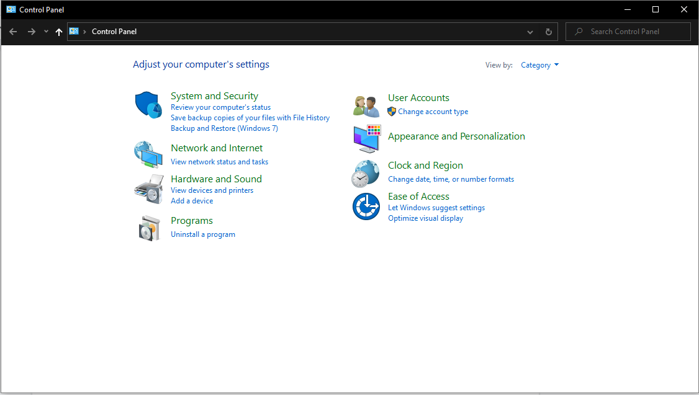
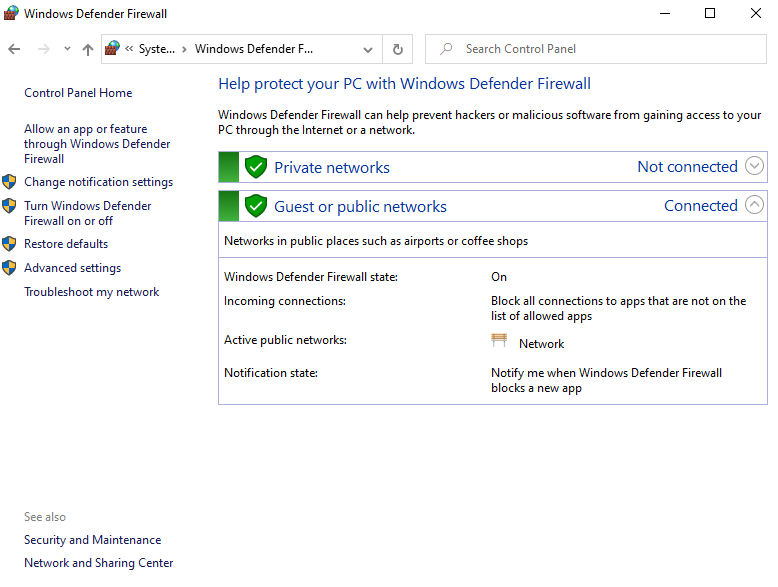
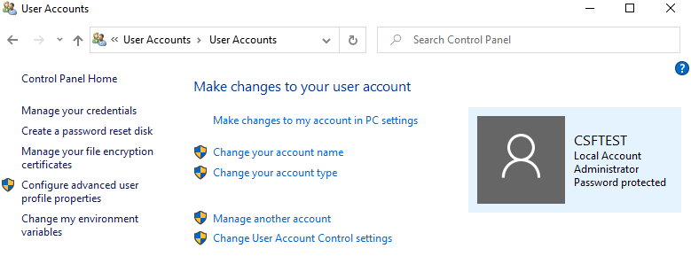
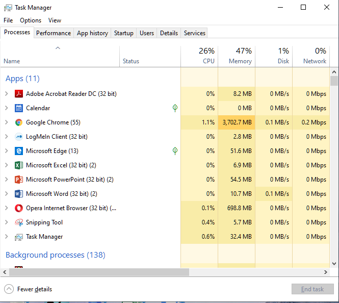
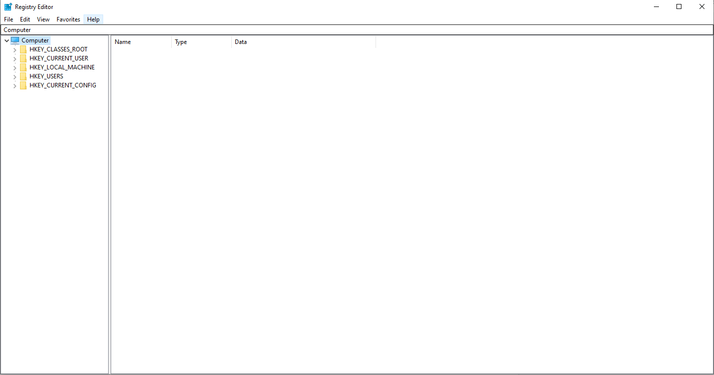

# Lab 08: Windows Control Panel and Registry

Before attempting this lab, please make sure you have completed all of the material in the lessons tab.

The table of contents for this lab is found below.

&nbsp;&nbsp;&nbsp;&nbsp;&nbsp;&nbsp; Part 1: Windows Control Panel and Windows Firewall  
&nbsp;&nbsp;&nbsp;&nbsp;&nbsp;&nbsp; Part 2: Windows User Management and Task Manager 
&nbsp;&nbsp;&nbsp;&nbsp;&nbsp;&nbsp; Part 3: Windows Registry 
&nbsp;&nbsp;&nbsp;&nbsp;&nbsp;&nbsp; Part 4: Submission  

Create a copy of this google document [lastname_lab08](https://docs.google.com/document/d/12COotwO6LSeT8X1xukjG7pxQDjKq4q78S_qKCk9kUMs/edit?usp=sharing) (File > Make a Copy) to record all of your assignment answers in.

## Part 1: Windows Control Panel and Windows Defender

### Windows Control Panel

The Control Panel is a component of Microsoft Windows that provides the ability to view and change system settings. It consists of a set of applets that include adding or removing hardware and software, controlling user accounts, changing accessibility options, and accessing networking settings. [Wikipedia](https://en.wikipedia.org/wiki/Control_Panel_(Windows))

**Step 1.1** Using your Windows 10 VM navigate to your Windows 10 control panel

:interrobang: Question 1 - Submit a screenshot of your Windows 10 Control Panel

**Step 1.2** Navigate to User Accounts > User Accounts

:interrobang: Question 2 - What group is your current user a part of? Provide a screenshot of your current user.

**Step 1.3** Move back to your Windows 10 control panel

**Step 1.4** Navigate to System and Security  > Administrative tools > System Information.

:interrobang: Question 3 - List the different security options you can enable here

**Step 1.5** Move back to your Windows 10 control panel

**Step 1.6** Navigate back to Administrative Tools > Task Scheduler

**Step 1.7** Create a task that will automatically launch your calculator when you log in to your Windows 10 machine

:interrobang: Question 4 - Submit a screenshot of your new scheduled task

### Windows Firewall

Windows Firewall, is a firewall component of Microsoft Windows. It was first included in Windows XP and Windows Server 2003. Prior to the release of Windows XP Service Pack 2 in 2004, it was known as Internet Connection Firewall. [Wikipedia](https://en.wikipedia.org/wiki/Windows_Firewall)

**Step 1.8** Move back to your Windows 10 control panel

**Step 1.9** Navigate to the Windows Defender Firewall

**Step 1.10** Select “Allow an app or feature through Windows Defender Firewall"

:interrobang: Question 5 - Submit a screenshot of the applications / features that aren’t allowed to communicate with the Firewall

**Step 1.11** While in the Windows Defender Firewall page select “Advanced settings” (in the left menu)

>  The “Advanced settings” page allows for further modification of firewall rules. Navigate to “Inbound Rules”. 

:interrobang: Question 6 - Create a New Rule that blocks TCP port 22 on a local port (outbound traffic). Name the rule SSH Block and submit a screenshot of this new rule.

:interrobang: Question 7 - Create a New Rule that blocks HTTP port 80 (inbound and outbound). Submit a screenshot of your new rule.

**Step 1.12** Open your browser and visit `uri.edu`.

:interrobang: Question 8 - Were you able to load the URI webpage? If not, why do you think this is the case?

:interrobang: Question 9 - Create a New Rule that blocks port 3389 (Provide a screenshot of the inbound rule). Submit a screenshot of your new rule.

**Step 1.13** Remove all of the port rules you created in Questions 5 - 8

:interrobang: Question 10 - What are network and application ports, and what are they used for?

:interrobang: Question 11 - What is port 3389, and what is it used for?

## Part 2: Windows User Management and Task Manager

### Windows User Management 

**Step 2.1** From your control panel, navigate to “User Accounts” > “Manage another account”

**Step 2.2** Create a new user named New Person1. Make the New Person a standard non-Microsoft local account.

**Step 2.3** Create a new user named New Person2. Make the New Person a standard non-Microsoft local account.

**Step 2.4** Click on “Groups”

**Step 2.5** Right-click on the Administrator group and add the New Person1 standard user account that you created to the Administrator group

**Step 2.6** Apply the changes

:interrobang: Question 12 - Submit a screenshot of the new administrator group members

:interrobang: Question 13 - What is the Administrator user group? What privileges do members of this group have over those that are not members of this group?

### Task Manager

**Step 2.8** In your Windows VM press `CTRL+R`, and type in `taskmgr.exe`

**Step 2.9** Select More Details > Startup

:interrobang: Question 14 - What does this tab display?

**Step 2.10** Select the `performance` tab

:interrobang: Question 15 - What does this tab display?

**Step 2.11** Switch to your New Person2 account that you created on your windows VM. Do *not* sign out of your current account.

**Step 2.12** In your New Person2 account, start the task manager and click on the “Users" tab. 

:interrobang: Question 16 - What does this tab display? 

:interrobang: Question 17 - Submit a screenshot of the Users tab

**Step 2.13** Delete the New Person1 and New Person2 user accounts

## Part 3: Windows Registry

**Step 3.1** In your Windows VM open a run command window (windows + R) and type ‘regedit’ 

There are 5 high-level directories called `Registry Hives` in the Windows registry: `HKEY_CLASSES_ROOT`, `HKEY_CURRENT_USER`, `HKEY_LOCAL_MACHINE`, `HKEY_USER`, `HKEY_CURRENT_CONFIG`. These registry hives contain the configuration settings, variables, and registry keys for Windows users and Windows applications. 

**Step 3.2** Google each of the Windows registry directories and identify what general content are managed in each 

:interrobang: Question 18 - What is the HKEY_USER Folder? What kind of information can a user find in the HKEY_USER Folder?

:interrobang: Question 19 - When you created the New Person1 and New Person2 accounts, do you think the contents of the HKEY_USER Folder changed? Why or why not.

:interrobang: Question 20 - How is the configuration for HKEY_CURRENT_USER generated? Where are these configurations stored in HKEY_USER?

:interrobang: Question 21 - What is the difference between the HKEY_CURRENT_USER and HKEY_LOCAL_MACHINE? 

:interrobang: Question 22 - What kind of settings does the HKEY_CLASSES_ROOT store? Is there an entry for regedit? If so, what does that folder contain? Provide a screenshot of the entry under ‘command’.

## Part 4. Submission

Convert your answer document into a **.PDF** and upload a single `lastname_lab8.pdf` answer document containing all of your answers to the assignment questions to Brightspace through the attachment uploads option.
