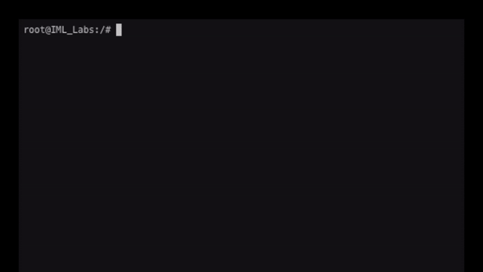
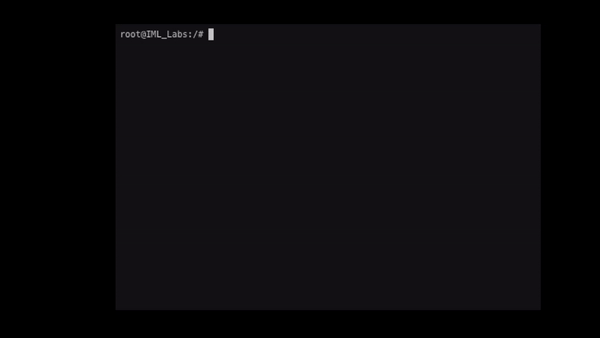
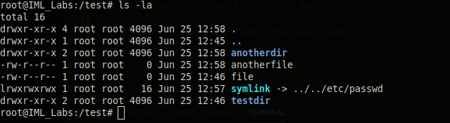
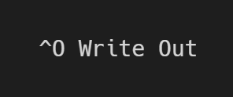

# Lab 09: Linux Command Line Interface

This week, we took a close look at the linux command line and macOS. It's important to note that many of the Linux commands we learned this week can also be used on macOS machines because of the kernals that both operating systems we build on. `cd`, `ls`, `mkdir`, `vi` and more are all commands that can be used in both Linux and macOS terminal enviorments.

The table of contents for this lab is found below.

&nbsp;&nbsp;&nbsp;&nbsp;&nbsp;&nbsp; Part 1: Command Line Introduction <br>
&nbsp;&nbsp;&nbsp;&nbsp;&nbsp;&nbsp; Part 2: Moving Around <br>
&nbsp;&nbsp;&nbsp;&nbsp;&nbsp;&nbsp; Part 3: Linux File Permissions <br>
&nbsp;&nbsp;&nbsp;&nbsp;&nbsp;&nbsp; Part 4: Changing Things <br>
&nbsp;&nbsp;&nbsp;&nbsp;&nbsp;&nbsp; Part 5. Editing Files <br>
&nbsp;&nbsp;&nbsp;&nbsp;&nbsp;&nbsp; Part 6. Submission <br>

Create a copy of this google document [lastname_lab09](https://docs.google.com/document/d/1do1tNkbEFviMK4b3bkwLNX9mlk-qEutII7-m-gu4FCw/edit?usp=sharing) (File > Make a Copy) to record all of your assignment answers in.

> :warning: Failure to use answer document properly will result in a 10pt deduction from final score.


## Part 1: Command Line Introduction

The below language is simply pulled from www.immersivelabs.com for your convenience. Please, read the information below and complete the [Command Line Introduction](https://immersivelabs.online/labs/command-line-introduction/) lab on immersivelabs.

#### Overview
The command line user interface (CLI) is also known as the terminal or console in Linux. It’s a means of interacting with a computer or program whereby the user or client issues commands via successive lines of text, known as command lines. A program that handles the interface is called a command language interpreter or shell.

Although most operating systems use a graphical user interface (GUI), the command line remains a popular tool, as it is quick, flexible and allows tasks to be automated. The CLI was the primary means of interaction with a computer in the mid-1960s and continued to be used until the 1980s. Today the GUI is more commonly used to navigate interactions with computer systems. However, software developers, system administrators and cyber security professionals continue to use the CLI.

To the left you will see the standard Linux terminal prompt. The terminal provides information about who and where we are as the user on the machine. The terminal then expects the user to input commands.

#### The prompt
There are four key components to a standard Linux prompt 

```text
[username]@[computername]:[path][$]
```

In our lab we are logged in as the user `‘Linux’` and our computer's name is `commandline-intro`, `~`. This indicates we are in our home directory, and the `$` symbol indicates we are a non-root or admin user.

If we were to change directory, you would see the path section change to reflect our new location. If we were logged in as the root user, the prompt would end in a # and the username portion of the prompt would change to root.

#### Entering commands
Commands are entered on a single line and executed with the return or enter key. Once the command completes, the output is returned to the user. Each command may have a different way of formatting the data on the screen.

If you try to run a command that doesn’t exist or there is an error in your command, the terminal should display an error message.

Below are some examples you can run in the CLI to show examples of good and bad commands with their output. You can also enter commands in the terminal yourself at any time.

Good command example: `ls`

Bad command example: `foo`

Below is an example using `ls` and `foo` and the expected outputs. 



#### Parameters
In the previous example we sent the ls command, which then returned a list of all the files in this directory.

Commands can also be given 'parameters' that change the way a command works. The next example will add some parameters to the ls command that changes the output and adds some useful information.

Enter `ls -ahtl` into the terminal.

This command shows owners, file permissions and file size as well as the files listed in the directory.

Below is an example of how `ls -ahtl` is used and what the output looks like.



:interrobang: Question 1. Submit a screenshot of your badge demonstrating the completion of this immersivelab module.

## Part 2: Moving Around

The below language is simply pulled from www.immersivelabs.com for your convenience. Please, read the information below and complete the [Moving Around](https://immersivelabs.online/labs/moving-around/) lab on immersivelabs.


#### About the Linux File Structure

> “On a UNIX system, everything is a file; if something is not a file it’s a process” - Machtelt Garrels

The above quote is an acceptable generalisation of the Linux file structure. Linux makes no difference between a file and directory as a directory is simply a file containing other files. Programs, services, text, images etc., are all considered files by Linux. Whilst this is a generalisation there are some exceptions. You can read more about those here. 

Similarly to a GUI, you move through a Linux system in the CLI the same way – there are just no mouse clicks. For the purposes of ease, folders or directories will be acknowledged as such, with files as files. Despite Linux seeing everything as files, it can get confusing for us humans not to identify them in unique ways.

#### Basic moving around within a file system

Files and directories

Linux handles all files and folders as files. A directory is seen as a file that holds a lot of other files. Depending on the terminal used, some will colour folders differently to files.

To find the current working directory, use the `pwd` command. `pwd` stands for print working directory. Sometimes it can get confusing as to which directory you may currently be working in, especially if you have navigated down several of them. This particular command is always helpful to ensure you are in the directory you think you are. 

Change directories with the `cd` command. This allows you to navigate up and down through directories. To move from a current working directory into another, the command will look like this:

cd directory_name

In order to move back up to the directory you originally navigated away from, you would use one of the following commands:

* `cd ..` (to go up one directory)

* `../../../` (to go up three directories)

* `../../directory1/directory2` (to go up to a specified directory

Listing files in a directory you would use the `ls` command. The ls command also has various operands that will determine what information is listed.

#### Arguments

Linux commands will sometimes have arguments, also known as 'options' or 'flags'. These are instructions after a command that specify what the command will do. For example, `ls` will list files in the current working directory but will not include any that have been hidden. Adding an argument to this will indicate to the command to include hidden files, e.g., `ls -a`. 

The only arguments you should need to remember are `-help`, `--help` or `-h`. The version of the argument will depend on the command you are applying it to. Add one of these to the end of any command and it will provide a list of all the available arguments for that command, a description and some examples. 

#### Output to CLI

Text editors can be used to modify files, but many require installation. An easy way to view the output of a file without the installation of an editor is to use the `cat` command. Short for ‘concatenate’, this command will write output to the CLI. It can be used to output results from commands as well as files and documents. 

`cat <file>`


:interrobang: Question 2. Submit a screenshot of your badge demonstrating the completion of this immersivelab module.

## Part 3: Linux File Permissions

The below language is simply pulled from www.immersivelabs.com for your convenience. Please, read the information below and complete the [Linux File Permissions
](https://immersivelabs.online/labs/linux-file-permissions/) lab on immersivelabs.

Linux file permissions can be viewed from the command line using `ls` and one of several command line switches, such as  `-l`.

A typical permission set looks like this:



The permissions are broken into four parts. The first character identifies the type:

* `d` is for a directory. 
* `-` is for a file.
* `l` is for a symlink.
 

A symbolic link (symlink) in Linux is a file that contains a reference to any file or directory. Symbolic links are used all the time to ensure files are in consistent places without moving or copying the original. They are often used to store multiple copies of the same file in different locations while still referencing the same file. They can be set using the ln command.

The next three sets of three characters identify the **read (r)**, **write (w)** and **execute (x)** permissions for owner, group members and everyone else, in that order.

Taking the entry for file in the above screenshot as an example:

* `-` indicates a file at the beginning of the permission set.
* `rw-` indicates the owner can read and write on the file but not execute.
* `r--` indicates that group members can read only.
* `r--` indicates that any other user is allowed to read only.

Following the permissions, we can also see the user and the group names; in this instance, root:root.

#### Special Permissions

There are three special permissions that can be used to override some behaviors. Each has their own specific use case.

#### SUID

When this special permission is applied, it forces that file to run as the file owner and not as the user who started the file. This bit can be set with `chmod u+s` or in numerical mode with a `4`; e.g., `4775`. It's possible to tell a file with this special permission where the `x` in the owner permissions field is replaced by an `s` or `S;` e.g., `-rwSrwxrwx`.

#### SGID

In principle, this gives the same permissions as SUID except it applies at group level rather than user level.

#### StickyBit

When creating files and directories, permissions are inherited from the parent. There are times when it is necessary to create a file that cannot be deleted in a user’s directory. StickyBit allows this as it is a special mode, meaning only the owner of the file can delete it. It is denoted by a ‘`t`’ at the end of the permissions string.

Using numbers
These permissions can also be set using a number instead of `r`, `w` or `x`.

* 0 = `---`
* 1 = `--x`
* 2 = `-w-`
* 3 = `-wx`
* 4 = `r-`
* 5 = `r-x`
* 6 = `rw-`
* 7 = `rwx`

You can view the numbered format by running `stat -c '%a - %n' *` from a Linux command line.

#### Chown and Chmod

If you have write permissions on a file, you can change any of the permissions. There are two base Linux commands that enable this function:

The `chown` command can change the owner and the group of a file or set of files.

Alternatively, the `chmod` command can change the permissions for the current user. It can either be given the character notation or the numerical notation.

For example, `chmod +x file.txt` would add an executable permission, while `chmod -w` would remove the write permission.

If a file has read and write but not execute permissions, using `-w` would make it read only (but only for the user running the command). To make changes for the group, you would pass the `-g` option as well as the permissions.

`chmod -g +x` would set the file executable for anyone in the group.

If you want to change permissions for your group and other users, you need to use the numerical notation.

`chmod 777 file.txt` would set the file to rwx for all users and groups. This is a state known as 'world writable'.

:interrobang: Question 3. Submit a screenshot of your badge demonstrating the completion of this immersivelab module.

## Part 4: Changing Things 

The below language is simply pulled from www.immersivelabs.com for your convenience. Please, read the information below and complete the [Changing Things](https://immersivelabs.online/labs/changing-things/) lab on immersivelabs.

When it comes to terminal commands there are typically various methods to achieve the same goal. This lab suggests using the following commands:

* touch – create an empty file 
* cp – copy a file to a new location
* mv – moves a file to a new location; this is also used to rename files
* mkdir – this creates a new directory
* rm – deletes a file from disk; additional options are needed to remove directories

There are different commands that can be used in this lab that will yield the same results. The commands listed are suggestions (or for those new to the Linux command line). Each of these commands has additional arguments which can be viewed by running the command with the help flag, i.e:

```text
touch --help
```

#### Navigating folders

Navigating folders in Linux command line is straightforward. To move down into a folder, the following command is used:

```text
cd down-folder
```

To move up a folder, use the following command:

```text
cd .. 
```

To move up multiple folders, use ../ for as many folders as required to reach your goal. For the below command you need to move from folder1 to home; however, you need to pass through folder2.

```text
cd ../../ 
```

#### Create new folder

To create a new folder in Linux, use the mkdir command. This is short for ‘make directory’.

```text
mkdir new-folder
```    

#### Create files

There are many ways to create files in Linux command line. Text editors such as Nano and Vim can be used to create files but require installation. 

```text
nano newfile
```    

```text
vim newfile.txt
```    

Touch will create an empty file where information can be added at a later date. 

```text
touch newfile
```    

```text
touch newfile.txt
```    

In either situation, you will need to specify the extension if a particular one is required. 

#### Rename files

Confusingly, the move command is used to rename files. mv will not only move files and directories but also rename files in the same folder.

To rename a file use

```text
mv file1 file2
```    

To move files or folders

```text
mv file1 /home/linux/folder1
```    

#### Copy files

Copy files using the following command

```text
cp file1 /home/linux/newfolder
```    

#### Remove files and folders

```text
rm file1
```    

```text
rm -r folder1
```    

> Note: Do not make changes in the folder other than those requested at each stage of the lab. Unexpected changes, like modifying, moving or deleting the files, folders or verify script, may prevent the correct token from being generated. 

:interrobang: Question 4. Submit a screenshot of your badge demonstrating the completion of this immersivelab module.


## Part 5 - Part 5. Editing Files

The below language is simply pulled from www.immersivelabs.com for your convenience. Please, read the information below and complete the [Editing Files](https://immersivelabs.online/labs/text-editors/category/knowledge/series/linux-command-line) lab on immersivelabs.

### Quick Summary

Editing text; it’s a basic need for any computer user. Where Windows has Wordpad and Notepad, Linux has Vim and Nano. This lab will outline the two most common text editors for Linux and how to use them via the command line.

#### Text editors and the command line

When using the Linux command line, you will sometimes need to edit text files and save any changes. You may want to use the command line to find and edit a hidden file, as it is easier to do than trying to hunt for it through a GUI.

The easiest way to create new empty files is by using the touch command: touch `filename`. Once your file has been created, you’re likely going to want to edit it. At the command line, there are a variety of options that may be available to you. There are two common text editors used on the CLI.

#### Nano

**Nano** is a “small and friendly” text editor and is commonly installed on Linux operating systems. Nano is considered a more user-friendly text editor compared to some of its more advanced counterparts.

One advantage nano has over its competitors is that the text editor provides several shortcuts to perform basic functions such as saving, quitting, justifying, and more. These shortcuts are listed at the bottom of the text editor when editing a file and are used by pressing CTRL + the shortcut letter. For example, the shortcut to quit Nano is CTRL+X, as shown in nano as:




To open a file using Nano, you simply enter the command nano and then the filename (e.g., `nano myfile`).


#### Vim

Vim is one of the oldest, most popular text editors belonging to the Linux family, and it is available across many different platforms and distributions. It began as an improved version of the Vi text editor, an early attempt at a visual text editor. Nowadays Vim has many more features than Vi had.

Opening a file with Vim uses the same syntax as opening a file with Nano. You simply enter `vim` and then the name of your file (e.g., `vim mySecondFile`)

The Vim editor has ***two modes, command and insert;*** opening a file launches you by default into command mode. In this mode, you can move the cursor, cut, copy, and paste text, as well as save and quit the document.

You can switch to insert mode by pressing the letter `i` on your keyboard. Once in this mode, any keystroke will be taken as input into the file. You can switch back to command mode at any point by pressing the **Esc** key on your keyboard.

Vim supports numerous options that can be displayed using the help argument `-h`. One such option, particularly helpful in editing large configuration files, is Vim's ability to open the file at a particular line number. For example, the command `vim +26 ~/.bashrc` would open the .bashrc file in the user’s home directory at line 26.

Commands Overview

`nano [file]` – open a file using the Nano editor
`vim [file]` – open a file using the Vim editor


:interrobang: Question 5. Submit a screenshot of your badge demonstrating the completion of this immersivelab module.

> :bulb: All of the commands and tools we've used in this lab will work in your Kali Linux VM. You can verify this by opening up your Kali VM and running a few commands! These commands will be very important in future courses where Kali is used to attack vulnerable systems.

## Part 6. Submission

Convert your answer document into a **.PDF** and upload a single `lastname_lab9.pdf` answer document containing all of your answers to the assignment questions to Brightspace through the attachment uploads option.
